# Plataforma GTE — Gestor Tecnológico Empresarial

## Documento Maestro de Diseño y Arquitectura

| Campo | Valor |
|---|---|
| Proyecto | GTE — Plataforma Integral de Gestión del Departamento de Desarrollo de Software |
| Cliente | Interflo |
| Versión del documento | 1.0 |
| Fecha | 2026-07-29 |
| Estado | Propuesta de diseño — pendiente de validación del equipo |
| Sucesor de | Gestor de Proyectos (GT, WinForms + bdsInfo) |
| Autores | Equipo de desarrollo Interflo + asistencia IA |

---

## Índice

1. [Resumen ejecutivo y drivers de diseño](#0-resumen-ejecutivo)
2. [Arquitectura general](#1-arquitectura-general)
3. [Modelo de datos](#2-modelo-de-datos)
4. [Módulos](#3-módulos)
5. [Flujos de trabajo (workflows)](#4-flujos-de-trabajo)
6. [Interfaces de usuario](#5-interfaces-de-usuario)
7. [Experiencia de usuario](#6-experiencia-de-usuario)
8. [Automatizaciones](#7-automatizaciones)
9. [Seguridad](#8-seguridad)
10. [API REST](#9-api-rest)
11. [Base de datos SQL Server](#10-base-de-datos-sql-server)
12. [Arquitectura .NET](#11-arquitectura-net)
13. [Frontend React](#12-frontend-react)
14. [Reportes](#13-reportes)
15. [Inteligencia artificial](#14-inteligencia-artificial)
16. [Entregables y roadmap](#15-entregables-y-roadmap)

---

## 0. Resumen ejecutivo

GTE es la plataforma que sustituye y absorbe al actual "Gestor de Proyectos" (GT) y se
convierte en el sistema único de administración del departamento de desarrollo: desde la
solicitud inicial de un cliente interno hasta el mantenimiento en producción, pasando por
requerimientos, análisis, diseño, planeación, desarrollo, QA, releases, soporte e
indicadores ejecutivos.

No es un gestor de tareas: es un sistema de gestión del **ciclo de vida completo del
software** (ALM), comparable a Jira + Azure DevOps + Monday, pero adaptado a los procesos,
horarios, niveles de ingeniero y reglas de negocio reales de Interflo.

### 0.1 Principios rectores

1. **Una sola fuente de verdad por dato.** Nada de catálogos duplicados (EAV vs tipados),
   contadores desnormalizados sin trigger, ni cuatro motores de cálculo de tiempo.
2. **Los workflows son datos, no código.** Un motor único de máquina de estados
   (clon del mecanismo transversal `tblProceso`/`tblTransicion`/`CambiarST` ya
   probado en el ecosistema Interflo) gobierna el ciclo de vida de toda entidad.
3. **El backend es la fuente de verdad.** El frontend manda acciones, nunca estatus
   destino; el estatus inicial lo fija el backend; los flags calculados se consumen directo.
4. **Seguridad por diseño.** RBAC real (no bitmaps posicionales), cero SQL interpolado,
   cero SQL almacenado en datos, auditoría de todo, autenticación real (no
   `Environment.UserName`).
5. **Amigable primero.** Toda pantalla se diseña para el usuario que la usa 40 veces al
   día: mínimo de clics, atajos, acciones en contexto, cero recargas completas.
6. **Modular y escalable.** Monolito modular con fronteras de dominio estrictas,
   divisible en servicios cuando el volumen lo exija, sin reescritura.

### 0.2 Drivers de diseño (lecciones del GT actual)

Este diseño corrige explícitamente la deuda documentada del sistema actual:

| Problema en GT actual | Respuesta de diseño en GTE |
|---|---|
| 4 motores de tiempo laborable inconsistentes | Un único servicio de calendario laboral (`fnMinutosLaborales` v2 + tabla de horarios + festivos), consumido por todos los reportes |
| Estatus como strings libres sin catálogo | Catálogos de estatus por proceso + motor de transiciones por datos |
| Permisos bitmap `nvarchar(500)` posicional | RBAC normalizado: usuarios, roles, permisos, alcances |
| SQL injection ubicuo, SQL almacenado en datos | EF Core parametrizado + reportes definidos como vistas/SPs versionados, nunca SQL en tablas |
| Sin PK/FK/índices en el núcleo | Modelo relacional completo con PK, FK, UNIQUE e índices desde el día 1 |
| `vw_Detalle` acoplada por posición al grid | API con DTOs tipados versionados |
| RTF embebido en columnas de texto | Contenido enriquecido en formato portable (HTML sanitizado / Markdown) + adjuntos en almacén de archivos con GUID |
| Historial de estatus como tabla de hechos (`tblHistorialEstatus`) | Se conserva y generaliza: es la base correcta del cálculo de tiempos y de las métricas de flujo (lead/cycle time) |
| Regla "una sola tarea En Proceso por persona" | Se conserva como regla de negocio configurable del workflow |
| Presupuesto de tiempo por complejidad x nivel de ingeniero | Se conserva y normaliza (matriz complejidad-nivel tipada) |
| Import Jira sin historial ni transacción | Importador transaccional idempotente con generación de historial |
| Conexión SQL compartida cifrada en registro | Autenticación por usuario (Entra ID/AD + JWT), sin credenciales en cliente |

### 0.3 Decisiones arquitectónicas clave (ADR resumidas)

| # | Decisión | Alternativas evaluadas | Justificación |
|---|---|---|---|
| ADR-01 | **Monolito modular** desplegado como una sola Web API, con módulos DDD aislados | Microservicios | Equipo de 2 desarrolladores; microservicios multiplican costo operativo sin beneficio a esta escala. Las fronteras de módulo permiten extraer servicios después |
| ADR-02 | **.NET 8 + React** (retargeteado desde .NET 9 el 2026-08-01, ver PENDIENTES.md §4-5: el servidor real de despliegue no tenía el runtime 9.0, y .NET 8 es LTS mientras 9 es STS) | .NET 8 + Angular (estándar Frente B vigente) | Decisión explícita del producto. El backend (.NET 8) ya **no** contradice InterfloClaude.md §6-8; el frontend (React vs Angular) **sigue divergiendo** -- pendiente ratificar o documentar GTE como Frente C solo por esa parte |
| ADR-03 | **Independencia total: todo vive en `bdsGTE`** — folios (`tblFolio` + `spGenerarFolio`) y motor de estatus (`tblProceso`/`tblTransicion`/`spCambiarEstatus`) propios, clonando el patrón transversal probado del ecosistema | Reutilizar `bdsCentral` (usp_GenerarFolio y CambiarST) | Decisión del equipo 2026-07-30: GTE no debe depender de ninguna otra base de datos; se replica el patrón §9, no se comparte la infraestructura |
| ADR-04 | Motor de workflow por datos (generalización de `CambiarST`) | Workflow en código, librería externa (Elsa, Camunda) | Ya existe, ya está probado, es genérico y auditable; las librerías externas agregan complejidad que 2 devs no deben operar |
| ADR-05 | CQRS ligero: Commands/Queries con MediatR, **sin** event sourcing ni bases separadas de lectura | Event sourcing completo | El historial de estatus ya da la dimensión temporal necesaria; ES completo es sobreingeniería |
| ADR-06 | Integración Git por **webhooks + API del proveedor**, tras la abstracción `IProveedorGit` (no hospedar Git propio) | Acoplarse solo a Gitea; repos embebidos | GTE referencia repositorios, no los reemplaza. La abstracción es necesaria porque conviven dos proveedores: Gitea self-hosted para los proyectos internos y GitHub para el propio GTE (ADR-09) |
| ADR-07 | Archivos adjuntos en filesystem/objeto con GUID + metadatos en BD | VARBINARY en BD (patrón Glosario actual) | Evita crecer la BD con binarios; el GUID de archivo es el patrón de la API central del ecosistema |
| ADR-08 | Tiempo real con SignalR (tableros, notificaciones) | Polling | El GT actual hace polling de 100 ms por bug; SignalR elimina la clase completa de problema |
| ADR-09 | **El código fuente de GTE vive en GitHub** (`github.com/Ocegueda23/GP-GTE`), de forma definitiva | Gitea self-hosted, que es el estándar del resto del ecosistema Interflo | Decisión del equipo (2026-07-30). Excepción explícita al estándar: aplica solo a este proyecto. Implicación registrada: para que GTE pueda trazar sus propios commits, la integración del módulo Desarrollo debe soportar GitHub además de Gitea (por eso ADR-06 abstrae el proveedor) |

### 0.4 Alcance funcional (mapa de capacidades)

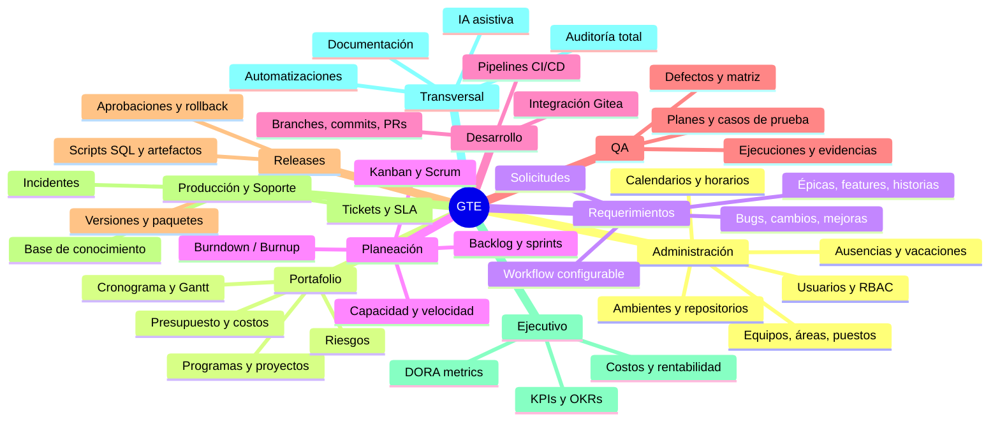

---

## 1. Arquitectura general

### 1.1 Arquitectura física (despliegue)

Infraestructura on-premise Interflo (misma red que el ecosistema SIS STS), con opción de
migrar a nube sin cambio de diseño.

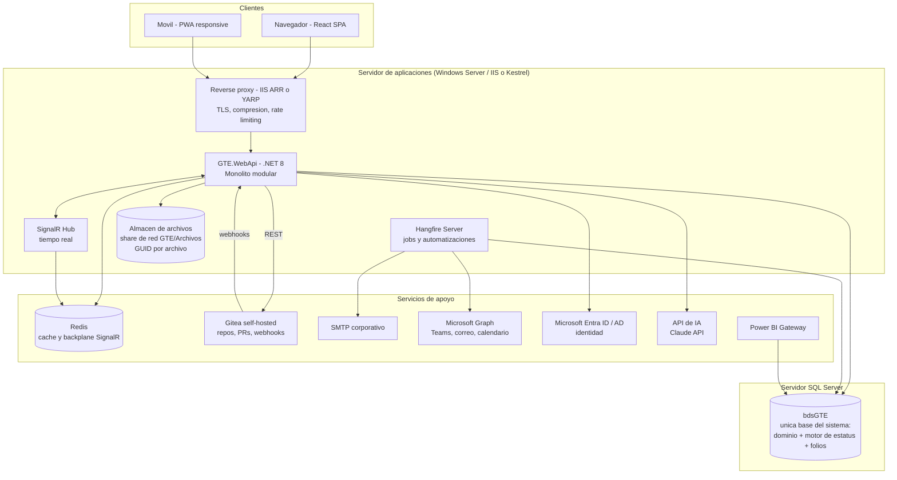

Topología mínima (fase 1): 1 servidor de aplicaciones + el servidor SQL existente.
Escalamiento (fase N): N instancias de la API tras el proxy (stateless, sesión en JWT,
cache y backplane en Redis), Hangfire en instancia dedicada.

### 1.2 Arquitectura lógica

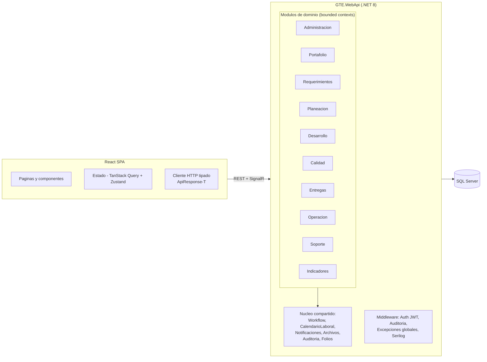

Reglas de comunicación entre módulos:

- Un módulo **nunca** consulta las tablas de otro módulo directamente; consume su
  **contrato público** (interfaz en `GTE.Contracts`) o reacciona a sus **eventos de
  dominio** (publicados in-process con MediatR `INotification`).
- El núcleo compartido (workflow, calendario, notificaciones, archivos, auditoría) es el
  único código transversal permitido; no contiene reglas de negocio de módulos.
- Los eventos de dominio relevantes se persisten en `tblEventoDominio` (patrón outbox) y
  Hangfire los despacha a integraciones externas (correo, Teams, webhooks) — garantiza
  entrega al-menos-una-vez sin acoplar la transacción de negocio al envío.

### 1.3 Arquitectura por capas (dentro de cada módulo)

Flujo estricto, alineado a InterfloClaude.md seccion 7:

```
Controller -> AppService (Application) -> Repository / QueryService (Infrastructure) -> DbContext
                    |
                    v
             Domain Services (logica pura, sin EF)
```

| Capa | Proyecto | Contiene | Prohibido |
|---|---|---|---|
| WebApi | `GTE.WebApi` | Controllers, middleware, `ApiResponse<T>`, AutoMapper profiles, Program.cs | Lógica de negocio |
| Application | `GTE.Application` | AppServices/handlers MediatR, DTOs Request/Response por feature, validadores FluentValidation, interfaces `I«Feature»QueryService` | Acceso directo a EF |
| Domain | `GTE.Domain` | Entidades por feature, excepciones (`NotFoundException`, `BusinessException`, `ConflictException`, `ForbiddenException`), interfaces `I«Feature»Repository`, servicios de dominio | Dependencias hacia afuera |
| Infrastructure | `GTE.Infrastructure` | DbContext por base (`DbContextGTE`, `DbContextCentral`), repositorios (escritura), query services (lectura/proyección), integraciones (Gitea, Graph, SMTP, IA) | Exponer entidades EF hacia afuera |

Lectura y escritura separadas (CQRS ligero): `Repository` escribe, `QueryService` lee y
proyecta a DTOs. Nunca se comparte un DTO entre entrada y salida.

### 1.4 Arquitectura basada en dominios (bounded contexts)

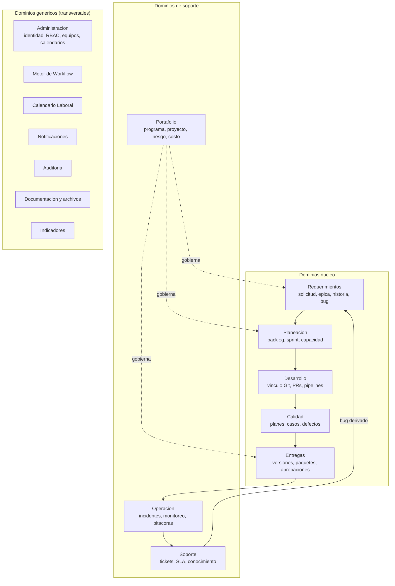

Lenguaje ubicuo (extracto — el glosario completo vive en el módulo Glosario, heredado del
GT actual):

| Término | Definición |
|---|---|
| Elemento de trabajo (WorkItem) | Unidad genérica rastreable: historia, bug, tarea, cambio, mejora, soporte, corrección |
| Solicitud | Petición de un cliente interno; puede convertirse en requerimiento o ticket |
| Presupuesto de tiempo | Minutos estimados = f(complejidad, nivel del ingeniero) — regla heredada del GT |
| Tiempo invertido | Suma de minutos laborables de los intervalos "En Proceso" del historial de estatus |
| Release | Conjunto versionado de artefactos (DLL, scripts SQL, archivos) que se despliega a un ambiente |
| Transición | Movimiento válido entre dos estatus de un proceso, disparado por una acción |

### 1.5 Escalabilidad

| Dimensión | Estrategia |
|---|---|
| API | Stateless: N instancias tras proxy; afinidad no requerida (JWT + Redis) |
| Lecturas pesadas (tableros, reportes) | QueryServices con proyecciones compiladas; cache Redis con invalidación por evento de dominio; vistas indexadas para agregados calientes |
| Cálculo de tiempos | Se materializa: al cerrar un intervalo de estatus se calculan y persisten los minutos laborables (columna `MinutosLaborales` en el historial) — el grid nunca ejecuta la función escalar (corrige el cuello de botella actual de `vw_Tiempos`) |
| Jobs | Hangfire con colas por prioridad (critical: SLA; default: notificaciones; low: reportes) |
| Tiempo real | SignalR con backplane Redis |
| Archivos | Share de red con GUID; migrable a blob storage cambiando el proveedor de `IAlmacenArchivos` |
| BD | Índices desde el día 1; particionado por fecha en tablas de historial/bitácora si superan decenas de millones de filas |

### 1.6 Seguridad (vista arquitectónica)

Detalle completo en la sección 8. En resumen: Entra ID/AD, OIDC, JWT corto + refresh
token; RBAC por rol y alcance (global/proyecto/equipo); auditoría desde token vía
`AuditMiddleware` (nunca del payload); TLS extremo a extremo; cero credenciales en cliente.

### 1.7 Integraciones

| Sistema | Dirección | Mecanismo | Uso |
|---|---|---|---|
| Gitea (proyectos internos) y GitHub (repositorio de GTE) | Bidireccional | Webhooks entrantes + REST API saliente, tras `IProveedorGit` | Vincular commits/branches/PRs a work items; disparar transiciones; crear branch desde historia. El proveedor se configura por repositorio (`tblRepositorio`) |
| Microsoft Entra ID / AD | Entrante | OIDC / LDAP fallback | Autenticación SSO, alta automática de usuarios |
| Microsoft Graph | Saliente | REST | Mensajes Teams, correo, calendario de reuniones |
| SMTP | Saliente | SMTP | Correos de notificación (fallback de Graph) |
| WhatsApp Business API | Saliente | REST (proveedor) | Alertas críticas de SLA e incidentes (opt-in) |
| Slack | Saliente | Webhooks | Solo si algún equipo lo usa; misma abstracción `ICanalNotificacion` |
| Jira (legado) | Entrante | Import Excel/CSV + REST opcional | Migración histórica; sustituye `sp_TareaJIRA` con importador transaccional |
| Power BI | Saliente | Vistas de lectura dedicadas (`vwBI*`) + usuario de solo lectura | Reportería corporativa |
| Claude API | Saliente | REST | Funciones de IA (sección 14) |
| Interflo SIS STS (ERP) | Bidireccional futuro | REST entre APIs | Solicitantes, empleados, presupuestos contables |

---

## 2. Modelo de datos

Base de datos **única** del sistema: **`bdsGTE`** (SQL Server, esquema `dbo` siempre). GTE
es totalmente independiente (ADR-03): los folios (`tblFolio` + `spGenerarFolio`) y el motor
de estatus (`tblProceso`/`tblTransicion`/`spCambiarEstatus`) viven dentro de `bdsGTE`,
clonando el patrón transversal del ecosistema sin compartir infraestructura con otras bases.

### 2.1 Convenciones (heredadas de InterfloClaude.md seccion 10)

- Tablas `tbl`, vistas `vw`, SPs `sp` + CamelCase, funciones `fn`, triggers `tr`.
- PK: `Id` + NombreTabla (`IdWorkItem`); FK: `Id` + entidad referenciada (`IdProyecto`).
- Constraints: `PK_`, `FK_tblOrigen_tblDestino`, `UQ_`, `CK_`, `DF_`, índices `IX_`.
- Auditoría de alta: `FechaRegistro DATETIME2`, `UsuarioRegistro NVARCHAR(200)`.
- Auditoría de movimiento: `UsuarioMovto NVARCHAR(50)`, `FechaMovto DATETIME`.
- Soft delete: `Activo BIT` (default 1). **Excepción**: borradores se eliminan con hard
  delete para no chocar con índices UNIQUE (seccion 7.7 del estándar).
- Tipos: PK/FK `INT`; nombres cortos `NVARCHAR(100)`; textos normales `NVARCHAR(200)`;
  largos `NVARCHAR(500)`; libres `NVARCHAR(MAX)`; fechas `DATETIME2`; flags `BIT`;
  dinero `DECIMAL(18,2)`; GUIDs de archivo `UNIQUEIDENTIFIER`.
- Sin tildes ni caracteres especiales en nombres de columnas (corrige `Descripción` del GT).
- Todo catálogo de estatus sigue la estructura estándar del motor: `Id, Descripcion,
  Orden, Activo` (`Orden` es solo visual, nunca navega el flujo).

### 2.2 Decisión central: WorkItem unificado

El GT actual tiene `tblTareas` + `tblSubtareas` + tipos implícitos por categoría de
proyecto. GTE unifica todo elemento rastreable en **`tblWorkItem`** con jerarquía por
`IdPadre` y tipo por catálogo:

```
Epica > Feature > Historia > Tarea
                  Bug / Cambio / Mejora / Soporte / Correccion  (pueden ser raíz o hijos)
```

Ventajas: un solo workflow configurable por tipo, un solo historial de estatus, un solo
mecanismo de comentarios/adjuntos/vínculos, y las "subtareas" del GT se convierten en
WorkItems tipo Tarea (conservando toda la información en la migración).

### 2.3 Modelo ER — Administración y seguridad

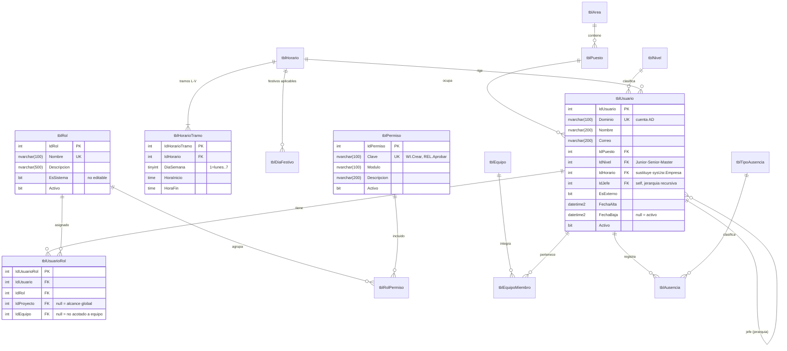

### 2.4 Modelo ER — Portafolio y proyectos

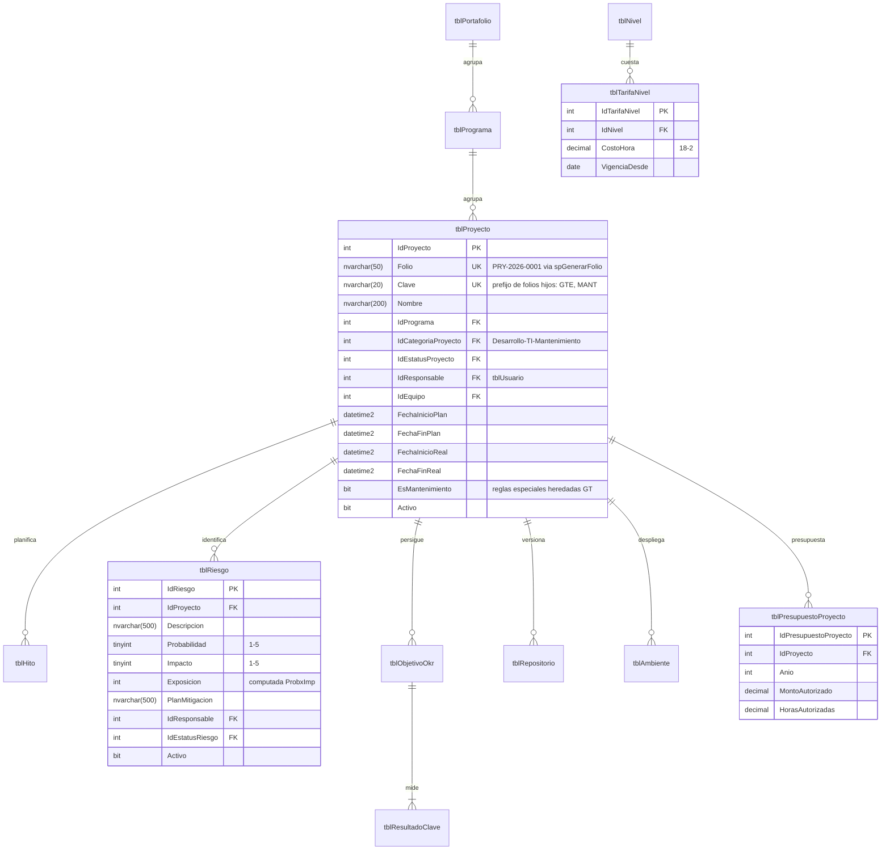

Costo real de un proyecto = suma de `tblRegistroTiempo.Minutos / 60 * tarifa vigente del
nivel del usuario` — nunca se almacena duplicado; se materializa solo en snapshots de KPI.

### 2.5 Modelo ER — Requerimientos y trabajo (núcleo)

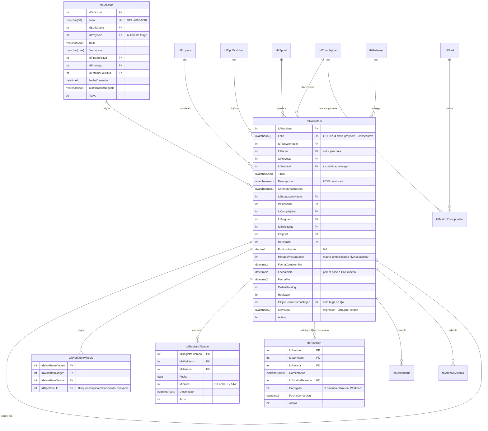

Historial de estatus (generalizado para TODA entidad con workflow — evolución directa de
`tblHistorialEstatus` del GT, que es la pieza mejor diseñada del sistema actual):

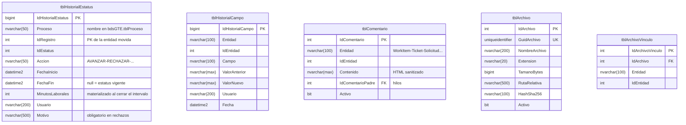

### 2.6 Modelo ER — Planeación

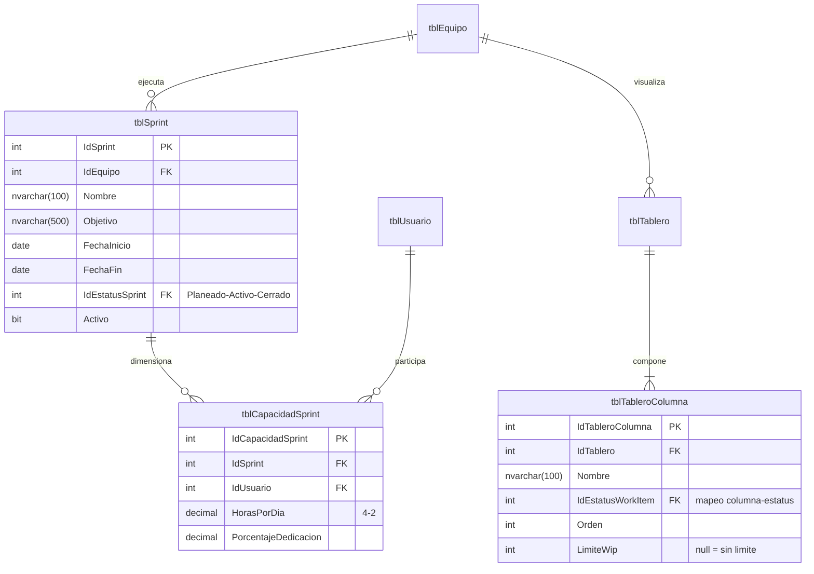

### 2.7 Modelo ER — Desarrollo, QA y Releases

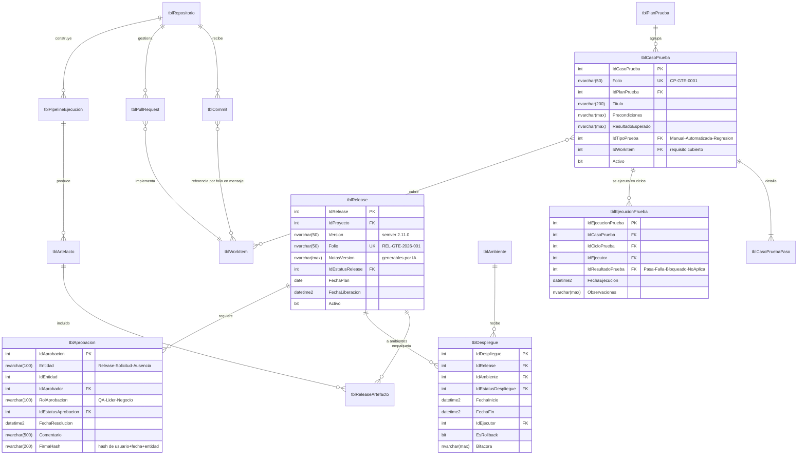

### 2.8 Modelo ER — Producción y Soporte

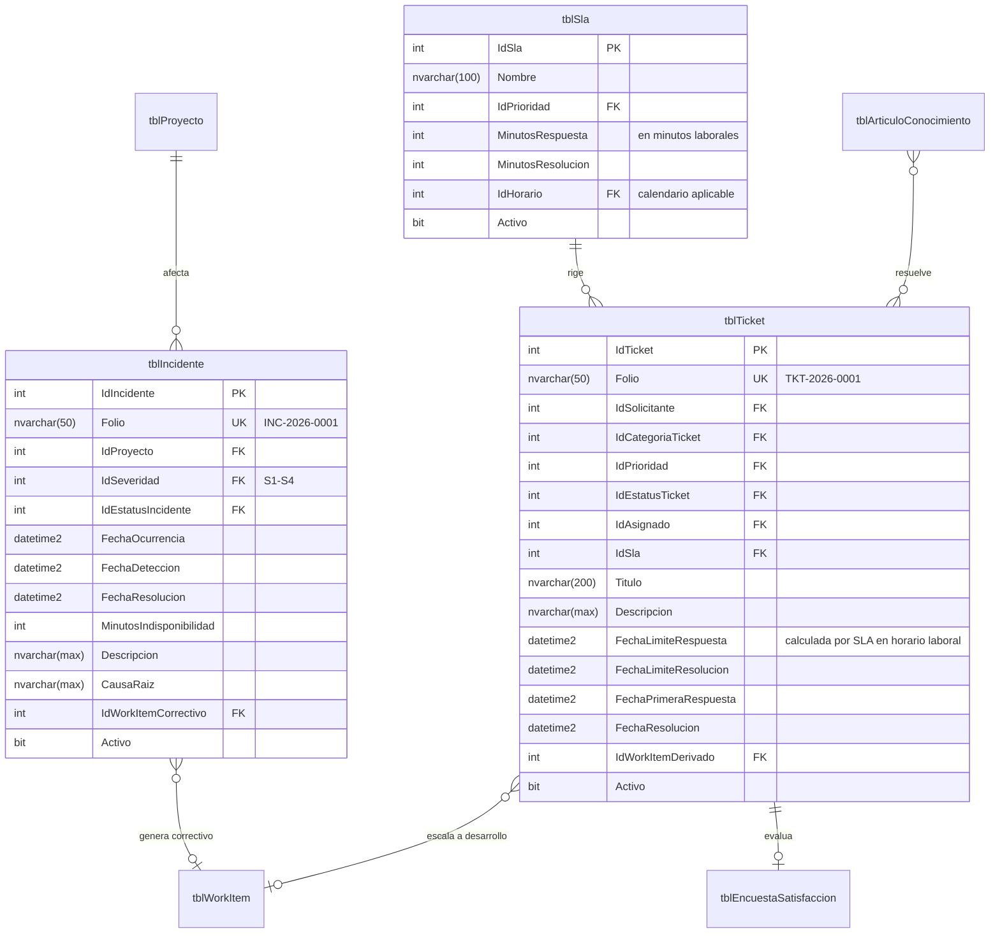

### 2.9 Catálogos

Tres clases (InterfloClaude.md seccion 10.2), **todos tipados** — el EAV
`tblCatalogoMaestro*` del GT actual NO se migra como mecanismo; sus datos se migran a
catálogos tipados:

| Clase | Tablas |
|---|---|
| De estatus (motor de workflow) | `tblEstatusSolicitud`, `tblEstatusWorkItem`, `tblEstatusSprint`, `tblEstatusRelease`, `tblEstatusDespliegue`, `tblEstatusIncidente`, `tblEstatusTicket`, `tblEstatusRiesgo`, `tblEstatusRevision`, `tblEstatusAprobacion`, `tblEstatusProyecto` — estructura estándar `Id, Descripcion, Orden, Activo` |
| Enumerados de ID fijo (sin IDENTITY) | `tblTipoWorkItem`, `tblTipoVinculo`, `tblPrioridad`, `tblSeveridad`, `tblResultadoPrueba`, `tblTipoPrueba`, `tblTipoArtefacto`, `tblTipoAusencia`, `tblTipoSolicitud`, `tblCategoriaProyecto` |
| Gestionados (IDENTITY, administrables) | `tblComplejidad` + `tblMatrizPresupuesto`, `tblNivel`, `tblArea`, `tblPuesto`, `tblEquipo`, `tblHorario`, `tblCategoriaTicket`, `tblSla`, `tblAmbiente`, `tblEtiqueta` (tags libres para WorkItems) |

`tblMatrizPresupuesto (IdComplejidad, IdNivel, Minutos, Puntos)` normaliza la regla
heredada del GT (COMPLEJIDAD.Cadena1/2/3 = tiempos Senior/Master/Junior y TipoDato =
Puntos) en una matriz tipada con `UNIQUE(IdComplejidad, IdNivel)`.

### 2.10 Índices principales

| Tabla | Índice | Columnas | Motivo |
|---|---|---|---|
| tblWorkItem | UQ_tblWorkItem_Folio | Folio | unicidad de folio |
| tblWorkItem | IX_tblWorkItem_Bandeja | IdAsignado, IdEstatusWorkItem, Activo INCLUDE (IdProyecto, FechaCompromiso, IdPrioridad, Titulo) | bandeja personal (pantalla más usada) |
| tblWorkItem | IX_tblWorkItem_Proyecto | IdProyecto, IdEstatusWorkItem | tableros por proyecto |
| tblWorkItem | IX_tblWorkItem_Sprint | IdSprint (filtrado WHERE IdSprint IS NOT NULL) | tablero de sprint |
| tblWorkItem | IX_tblWorkItem_Padre | IdPadre (filtrado) | árboles |
| tblWorkItem | UQ_tblWorkItem_ClaveJira | ClaveJira (filtrado WHERE ClaveJira IS NOT NULL) | idempotencia de import (corrige duplicados de sp_TareaJIRA) |
| tblHistorialEstatus | IX_tblHistorialEstatus_Registro | IdProceso, IdRegistro, FechaInicio | timeline y tiempos |
| tblHistorialEstatus | IX_tblHistorialEstatus_Abiertos | IdProceso, IdEstatus (filtrado WHERE FechaFin IS NULL) | estatus vigentes, WIP |
| tblRegistroTiempo | IX_tblRegistroTiempo_UsuarioFecha | IdUsuario, Fecha | reportes de horas |
| tblRegistroTiempo | IX_tblRegistroTiempo_WorkItem | IdWorkItem | tiempo invertido por item |
| tblTicket | IX_tblTicket_SlaVigilancia | IdEstatusTicket, FechaLimiteResolucion (filtrado abiertos) | job de vigilancia SLA |
| tblComentario | IX_tblComentario_Entidad | Entidad, IdEntidad | carga de detalle |
| tblArchivoVinculo | IX_tblArchivoVinculo_Entidad | Entidad, IdEntidad | adjuntos |
| tblBitacora | IX_tblBitacora_EntidadFecha | Entidad, IdEntidad, Fecha | auditoría |
| tblUsuario | UQ_tblUsuario_Dominio | Dominio | login |
| tblNotificacion | IX_tblNotificacion_Usuario | IdUsuario, Leida (filtrado no leídas) | campana de notificaciones |

### 2.11 Auditoría, historial y soft delete (política)

| Mecanismo | Qué captura | Dónde |
|---|---|---|
| Columnas de auditoría | Quién/cuándo creó y movió cada fila | Todas las tablas de negocio |
| `tblHistorialEstatus` | Ciclo de vida completo + minutos laborables por intervalo | Toda entidad con workflow |
| `tblHistorialCampo` | Cambio campo a campo (valor anterior/nuevo) | Campos sensibles: asignado, compromiso, prioridad, estimación, presupuesto |
| `tblBitacora` | Toda operación de escritura de la API (usuario del token, IP, endpoint, entidad) | Transversal, escrita por `AuditMiddleware` con contexto de vida corta (sobrevive rollbacks) |
| Soft delete | `Activo = 0`; los listados filtran por defecto | Todas, excepto borradores (hard delete) |
| Sin UPDATE destructivo | Los campos de auditoría de alta nunca se modifican | Regla de repositorio base |

---

## 3. Módulos

Cada módulo se especifica con: objetivo, funcionalidades, reglas de negocio y permisos.
Las pantallas se detallan en la sección 5; los endpoints en la sección 9.

### 3.1 Administración

**Objetivo:** gobernar identidad, estructura organizacional, calendarios y configuración
técnica base.

| Submódulo | Funcionalidades |
|---|---|
| Usuarios | Alta automática desde Entra ID/AD al primer login (aprovisionamiento JIT) + gestión manual; puesto, nivel (Junior/Senior/Master), horario, jefe, correo; baja lógica con fecha |
| Roles y permisos | CRUD de roles; matriz rol-permiso con permisos por clave (`WI.Crear`, `REL.Aprobar`, `ADM.Usuarios`); asignación usuario-rol con alcance (global, por proyecto o por equipo); roles semilla: Administrador, Lider, Coordinador, Desarrollador, QA, Soporte, Solicitante, Ejecutivo |
| Equipos | Equipos con miembros, rol dentro del equipo y porcentaje de dedicación; un usuario puede estar en varios equipos |
| Áreas y puestos | Catálogos organizacionales simples |
| Calendarios y horarios | Horarios con tramos por día (soporta turnos partidos heredados: BANSI 08:30-14:30 + 17:00-19:30, etc.); días festivos por horario o globales; vista de calendario anual |
| Vacaciones y ausencias | Solicitud de ausencia por tipo (vacaciones, incapacidad, permiso); flujo de aprobación por jefe (motor de workflow); las ausencias aprobadas descuentan capacidad de sprint y pausan SLA personales |
| Ambientes | Catálogo de ambientes por proyecto (DEV, QA, PREPROD, PROD) con URL, servidor, base de datos y responsable |
| Repositorios | Vínculo proyecto-repositorio (proveedor Gitea o GitHub, URL, secreto de webhook); prueba de conexión |
| Versiones del sistema | Historial de versiones de GTE mismo (sustituye `tblVersion`/`frmInfo`): notas visibles con "qué hay de nuevo" al iniciar sesión tras un release |

**Reglas de negocio:**

- RN-ADM-01: un usuario no puede ser su propio jefe ni formar ciclos en la jerarquía
  (validación con CTE recursivo antes de guardar).
- RN-ADM-02: el rol Administrador no cortocircuita las validaciones de negocio (a
  diferencia del `EsAdmin` del GT); solo otorga todos los permisos. Las reglas duras
  (p. ej. no cerrar un WorkItem con revisiones pendientes) aplican a todos. **Excepcion
  acotada (decision del equipo, 2026-08-02):** el cierre de WorkItems (RN-REQ-03) y el
  ownership de cambios de estatus (WI.ModificarAjeno, ver RN-REQ-05) SI se saltan para
  quien tenga el permiso nuevo `WI.OmitirValidacionCierre` (sembrado solo para
  Administrador, mismo patron RBAC data-driven, sin cortocircuito de codigo por rol). El
  resto de reglas duras del proceso (RN-REQ-01 una sola tarea En Proceso por persona,
  RN-REQ-02 fecha compromiso) NO se saltan ni para Administrador. Ver
  `CambiarEstatusWorkItemHandler` y `14_2026-08-02_INSERT_bdsGTE_PermisoOmitirValidacionCierre.sql`.
- RN-ADM-03: la jerarquía jefe-subordinado define el alcance de visibilidad por defecto
  de bandejas y reportes (CTE recursivo, heredado del GT); los permisos pueden ampliarlo.
- RN-ADM-04: cambios de nivel de un usuario NO recalculan presupuestos de WorkItems ya
  asignados (el presupuesto se fija al asignar y queda en el historial de campo).

### 3.2 Gestión de proyectos (Portafolio)

**Objetivo:** visión y control ejecutivo de programas y proyectos: alcance, tiempo,
costo, riesgo.

| Funcionalidad | Detalle |
|---|---|
| Portafolio / Programa / Proyecto | Jerarquía de 3 niveles; el proyecto es la unidad operativa (clave para folios de WorkItems) |
| Objetivos (OKR) | Objetivos por proyecto/área con resultados clave medibles ligados a KPIs |
| Presupuesto | Monto y horas autorizadas por año; consumo real derivado de registro de tiempos x tarifas por nivel |
| Costos | Tarifas por nivel con vigencia; costo por proyecto/desarrollador calculado, nunca capturado |
| Recursos | Asignación de equipos a proyectos; vista de ocupación por persona (suma de dedicaciones) |
| Riesgos | Matriz probabilidad x impacto (1-5); exposición calculada; plan de mitigación; workflow (Identificado, Mitigando, Materializado, Cerrado) |
| Cronograma / Gantt | Hitos y fases con fechas plan/real; Gantt interactivo alimentado por WorkItems tipo Épica/Feature con dependencias |
| Dependencias | Vínculos Bloquea/DependeDe entre WorkItems y entre hitos; detección de ciclos |
| Indicadores | Salud del proyecto (semáforo alcance/tiempo/costo), % avance por puntos completados, desviación vs plan |

**Reglas de negocio:**

- RN-PRY-01: un proyecto con WorkItems abiertos no puede cerrarse (409 con lista de
  pendientes — patrón de conflicto estructurado).
- RN-PRY-02: proyectos `EsMantenimiento = 1` conservan las reglas especiales del GT:
  cerrar un WorkItem exige permiso `WI.TerminarMantenimiento`; mover un WorkItem fuera del
  proyecto exige permiso de administrador del proyecto.
- RN-PRY-03: la exposición de riesgo >= 15 (de 25) notifica automáticamente al
  responsable del proyecto y aparece en el dashboard ejecutivo.

### 3.3 Requerimientos

**Objetivo:** capturar, analizar y trazar toda petición desde su origen hasta su entrega.

| Funcionalidad | Detalle |
|---|---|
| Solicitud | Portal simple para clientes internos (rol Solicitante): título, descripción, tipo, justificación, fecha deseada, adjuntos. Folio SOL-AAAA-NNNN |
| Triage | Bandeja de solicitudes nuevas para líderes: aceptar (convierte en WorkItem(s) con trazabilidad), rechazar (con motivo, notifica), o derivar a ticket de soporte |
| Jerarquía | Épica > Feature > Historia > Tarea; Bug/Cambio/Mejora/Soporte/Corrección como tipos con workflows propios |
| Historias | Plantilla "Como... quiero... para..."; criterios de aceptación estructurados (lista Gherkin opcional); generables por IA desde la solicitud |
| Adjuntos | Archivos por GUID (imágenes pegables desde portapapeles, hereda UX del editor del GT) |
| Comentarios | Hilos con menciones `@usuario` (notifican), contenido enriquecido sanitizado |
| Seguimiento | Timeline unificado por item: cambios de estatus, de campos, comentarios, commits, ejecuciones de prueba |
| Workflow configurable | Por tipo de WorkItem, administrado por datos (sección 4) |
| Etiquetas | Tags libres para clasificación transversal |

**Reglas de negocio (núcleo — heredadas del GT y formalizadas):**

- RN-REQ-01 (**una tarea En Proceso por persona**): al ejecutar la acción INICIAR sobre un
  WorkItem, si el asignado tiene otro item En Proceso, este se suspende automáticamente
  registrando historial **en el item suspendido** (corrige el bug #4 del GT que escribía
  el historial en la tarea equivocada). La regla es configurable por tipo de item.
- RN-REQ-02: INICIAR exige `FechaCompromiso` capturada.
- RN-REQ-03: TERMINAR exige: al menos un registro de tiempo o subtarea hija terminada, y
  cero revisiones con `Corregido = 0`. Una sola implementación en el dominio (corrige los
  dos caminos inconsistentes de FrmRegistro vs FrmTareaSTS.btnTerminar). Bypass acotado
  para `WI.OmitirValidacionCierre` (ver RN-ADM-02).
- RN-REQ-04: `FechaCompromiso` no puede ser anterior a hoy, salvo permiso
  `WI.ModificarCompromiso`.
- RN-REQ-05: editar un item Terminado exige `WI.ModificarTerminado`; editar, cambiar el
  estatus (INICIAR/TERMINAR/etc.), registrar tiempo, o marcar CORREGIDO un hallazgo (no
  reabrirlo, eso es RN-QA-02) en un item ajeno exige `WI.ModificarAjeno` -- el gate de
  ownership aplica igual en `ActualizarWorkItemCommand`, `CambiarEstatusWorkItemCommand`,
  `RegistrarTiempoCommand` y `CorregirRevisionCommand` (unificado 2026-08-02; los dos
  ultimos se quedaron sin el gate en pasadas anteriores del mismo dia y se corrigieron al
  reproducirlos en vivo con cuentas Desarrollador reales -- ver lecciones en PENDIENTES.md
  seccion 5). **"Ajeno" incluye SIN asignar** (decision del equipo 2026-08-02): un
  WorkItem con `IdAsignado = NULL` se trata igual que uno asignado a otra persona -- nadie
  "toma" trabajo del backlog solo con INICIAR o registrando tiempo; un Lider/Admin con
  `WI.ModificarAjeno` tiene que asignarlo primero (vía editar). Deliberadamente SIN este
  gate (no es un hueco, es el diseño): comentar, adjuntar archivos y reportar un hallazgo
  -- son acciones de colaboracion/revision hechas por definicion por alguien mas, no una
  modificacion del registro propio del WorkItem.
- RN-REQ-06: eliminar solo en estatus Borrador/Pendiente con permiso `WI.Eliminar` (hard
  delete si Borrador, baja lógica si Pendiente).
- RN-REQ-07: COPIAR duplica el item limpiando: estatus (lo fija el backend), compromiso,
  historial; complejidad siempre la mínima; sufijo " - Copia" (regla vigente del GT,
  commits e6b2c81/bec2388).
- RN-REQ-08: al asignar un item, `MinutosPresupuesto` se calcula de
  `tblMatrizPresupuesto(IdComplejidad, Nivel del asignado)` y se congela.
- RN-REQ-09: los estatus con más de N días sin movimiento generan alerta al líder
  (parámetro por proyecto).

### 3.4 Planeación

**Objetivo:** convertir el backlog en compromisos alcanzables y visualizar el flujo.

| Funcionalidad | Detalle |
|---|---|
| Backlog | Lista priorizada por proyecto/equipo con orden manual (drag & drop persiste `OrdenBacklog`), filtros y estimación rápida inline |
| Sprint | Ciclos por equipo con objetivo, fechas, capacidad por persona (horas/día x días laborables de SU horario, menos ausencias aprobadas — usa el servicio de calendario laboral) |
| Kanban | Tablero configurable por equipo: columnas mapeadas a estatus, límites WIP, swimlanes por prioridad/persona, colores por vencimiento (rojo vencida, verde en proceso — semántica heredada del GT) |
| Scrum | Ceremonias soportadas: planning (asignar del backlog al sprint contra capacidad), daily (vista "mi día"), review (items terminados del sprint), retro (notas ligadas al sprint) |
| Roadmap | Línea de tiempo por trimestre de épicas y releases planeadas |
| Estimaciones | Puntos de historia + presupuesto en minutos por matriz complejidad-nivel; comparación estimado vs real automática |
| Velocidad | Puntos completados por sprint (promedio móvil de 3) para proyectar capacidad |
| Burndown / Burnup | Calculados de `tblHistorialEstatus` (puntos restantes por día del sprint), sin snapshots manuales |

**Reglas de negocio:**

- RN-PLA-01: asignar más puntos que la velocidad histórica +20% al planear un sprint
  requiere confirmación explícita (soft warning, no bloqueo).
- RN-PLA-02: cerrar un sprint mueve automáticamente los items no terminados al backlog o
  al siguiente sprint (decisión del usuario en el cierre), registrando el movimiento.
- RN-PLA-03: un WorkItem solo puede estar en un sprint a la vez.
- RN-PLA-04: exceder el límite WIP de una columna bloquea el drop con explicación (o
  permite override con permiso `PLA.SaltarWip`, registrado en bitácora).

### 3.5 Desarrollo

**Objetivo:** trazar el trabajo técnico real (Git, CI/CD) contra los WorkItems, sin
duplicar a Gitea.

| Funcionalidad | Detalle |
|---|---|
| Vínculo Git | Webhook del proveedor (Gitea o GitHub): push/PR/tag. Los mensajes de commit que mencionan un folio (`GTE-123`) se vinculan automáticamente al WorkItem |
| Crear branch | Botón "Crear rama" en el WorkItem: crea `feature/GTE-123-slug` vía API del proveedor |
| Pull/Merge Requests | Estado del PR visible en el WorkItem; abrir PR puede transicionar el item a "En Revisión" (automatización configurable); merge puede transicionar a "En Pruebas" |
| Commits | Lista de commits vinculados con autor, fecha y diff-link a Gitea |
| Pipelines CI/CD | Registro de ejecuciones (build/deploy) reportadas por Gitea Actions vía webhook: estatus, duración, ambiente, artefactos producidos |
| Artefactos | Registro de artefactos (DLL, paquetes, scripts SQL) con hash SHA-256 y GUID de archivo, consumidos por el módulo Releases |

**Reglas de negocio:**

- RN-DEV-01: los webhooks se autentican por secreto compartido por repositorio; payloads
  no autenticados se descartan y se registran.
- RN-DEV-02: la vinculación commit-WorkItem es por folio en el mensaje; un commit puede
  vincular varios items.
- RN-DEV-03: las transiciones automáticas por eventos Git son configurables por proyecto
  y siempre pasan por el motor de workflow (nunca UPDATE directo de estatus).

### 3.6 QA (Calidad)

**Objetivo:** planear, ejecutar y evidenciar pruebas; gobernar defectos.

| Funcionalidad | Detalle |
|---|---|
| Plan de pruebas | Por release o por proyecto; agrupa suites y casos; % avance de ejecución |
| Casos de prueba | Folio CP-«clave»-NNNN, precondiciones, pasos numerados (tabla hija), resultado esperado, tipo (manual/automatizada/regresión), vínculo al requisito que cubre |
| Ciclos de ejecución | Un plan se ejecuta en ciclos (ej. "Ciclo 1 QA", "Regresión pre-release"); cada caso registra resultado: Pasa, Falla, Bloqueado, No aplica |
| Evidencias | Capturas/archivos adjuntos por ejecución |
| Defectos | Falla -> botón "Crear bug" precargado (caso, paso, evidencia, release); el bug es un WorkItem tipo Bug con `IdEjecucionPruebaOrigen` |
| Matriz de trazabilidad | Requisito x casos x resultado último ciclo: detecta requisitos sin cobertura |
| Revisiones (code review interno) | Se conserva el flujo del GT: hallazgos por WorkItem con `Corregido`, reapertura solo por líder, cierre masivo con permiso `REV.Activar`. **Implementado**: reportar hallazgo reabre el item Terminado a Corrección (transición `RECHAZAR_QA` desde Terminado, sembrada por datos); marcar corregido mueve el hallazgo por su propio proceso; reabrir exige `REV.Reabrir` y motivo |
| Automatización | Endpoint para que pipelines reporten resultados de pruebas automatizadas (JUnit XML) contra casos tipo Automatizada |
| Cobertura | % requisitos con casos, % casos ejecutados, % pasa por ciclo |

**Reglas de negocio:**

- RN-QA-01: un release no puede aprobarse con casos Falla sin bug asociado o bugs S1/S2
  abiertos (409 estructurado con la lista).
- RN-QA-02: reabrir un hallazgo corregido exige rol Líder (regla vigente del GT).
- RN-QA-03: el estatus del WorkItem reacciona a las revisiones: alguna con Corregido=0
  regresa el item de Terminado a Corrección vía workflow (formaliza
  `ValidarSiHayRevisionesPendientes`).
- RN-QA-04 (2026-08-02): aprobar (TERMINAR) o rechazar (RECHAZAR_QA) la fase de pruebas de
  un WorkItem, desde En Pruebas, exige el permiso `WI.AprobarPruebas` (sembrado para el rol
  QA por datos en `tblTransicionConfig.RequierePermiso`, no un cortocircuito de código). El
  TERMINAR desde En Proceso (la ruta "proyectos sin fase QA") sigue sin exigirlo.
- RN-QA-05 (2026-08-02): no autoaprobación ni autorechazo -- quien aprueba/rechaza la fase
  de pruebas no puede ser el propio asignado del WorkItem. Por esto mismo, el gate de "item
  ajeno" (RN-REQ-05) se excluye a propósito para estas dos transiciones: lo normal es que
  el revisor sea otra persona.
- RN-QA-06 (2026-08-02): no se puede rechazar (RECHAZAR_QA desde En Pruebas) sin que ya
  exista un Hallazgo/Revisión pendiente registrado para el WorkItem -- un motivo de texto
  libre ya no basta. Implementado en `CambiarEstatusWorkItemHandler.ValidarRevisionPruebasAsync`;
  las tres reglas anteriores tienen bypass acotado con `WI.OmitirValidacionCierre`
  (Administrador, ver RN-ADM-02).

### 3.7 Releases (Entregas)

**Objetivo:** empaquetar, aprobar, desplegar y — si hace falta — revertir versiones.

| Funcionalidad | Detalle |
|---|---|
| Versiones | Semver por proyecto; el release agrupa WorkItems terminados |
| Contenido | Scripts SQL (con orden de ejecución y script de rollback pareado), DLL/paquetes, archivos de configuración — todos como artefactos con hash |
| Notas de versión | Generadas automáticamente del contenido (títulos de WorkItems por tipo) + edición manual; publicables al canal de Teams |
| Aprobaciones | Cadena configurable por proyecto (ej. QA -> Líder -> Negocio); cada aprobación con firma electrónica (hash usuario+fecha+entidad, respaldado por bitácora) |
| Despliegues | Registro por ambiente con bitácora; checklist de despliegue; despliegue a PROD exige release Aprobado y ventana de cambio |
| Rollback | Acción explícita que crea un despliegue `EsRollback=1` ejecutando los scripts de rollback en orden inverso; deja el release en estatus Revertido |
| Ambientes | Vista "qué versión vive en cada ambiente" por proyecto (matriz proyecto x ambiente) |

**Reglas de negocio:**

- RN-REL-01: solo WorkItems en estatus Terminado y revisados pueden agregarse a un release.
- RN-REL-02: todo script SQL de despliegue debe tener script de rollback asociado o
  justificación explícita de irreversibilidad (campo obligatorio).
- RN-REL-03: el paso a PROD exige todas las aprobaciones de la cadena en Aprobado.
- RN-REL-04: publicar un release notifica a solicitantes de los WorkItems incluidos
  ("tu petición SOL-2026-0045 se liberó en la versión 2.11").

### 3.8 Producción (Operación)

**Objetivo:** visibilidad y control de lo que corre en producción.

| Funcionalidad | Detalle |
|---|---|
| Incidentes | Folio INC, severidad S1-S4, timeline de atención, causa raíz (postmortem ligero), vínculo al WorkItem correctivo y al release causante |
| Disponibilidad | Minutos de indisponibilidad por incidente -> % uptime mensual por sistema |
| Monitoreo | Integración pasiva: endpoints de health check de los sistemas registrados; job de Hangfire los sondea y abre incidente automático tras N fallos consecutivos |
| Bitácora de cambios | Todo cambio en PROD (release, hotfix, cambio de configuración manual) queda en `tblBitacoraCambio` — responde "qué cambió ayer" |
| Logs | Vínculo a la herramienta de logs (Serilog/Seq); GTE no almacena logs de aplicaciones ajenas |

**Reglas de negocio:**

- RN-OPS-01: incidente S1 notifica de inmediato por todos los canales al responsable del
  sistema y al líder (escalamiento a los 30 min sin atención).
- RN-OPS-02: cerrar un incidente S1/S2 exige causa raíz documentada.
- RN-OPS-03: un incidente puede degradarse/escalarse de severidad solo con motivo
  registrado.

### 3.9 Soporte (Mesa de ayuda)

**Objetivo:** atención estructurada a usuarios con compromisos de servicio medibles.

| Funcionalidad | Detalle |
|---|---|
| Tickets | Portal de captura simple (o derivación desde solicitud/correo); categoría, prioridad; folio TKT |
| SLA | Por prioridad: minutos laborales de primera respuesta y de resolución (usa el calendario laboral del equipo de soporte); semáforo y % cumplimiento |
| Mesa de ayuda | Bandeja por agente y por cola; asignación manual o round-robin; estados: Nuevo, En Atención, Esperando Usuario (pausa SLA), Resuelto, Cerrado |
| Escalamiento | A desarrollo: crea WorkItem tipo Soporte vinculado; el ticket sigue vivo y se resuelve cuando el WorkItem se libera |
| Base de conocimiento | Artículos versionados con búsqueda (evolución del Glosario Interflo, que se migra completo con sus imágenes y tags de redirección); sugerencia de artículos al capturar ticket (IA, sección 14) |
| Encuestas | Al resolver: calificación 1-5 + comentario; CSAT por agente/mes |

**Reglas de negocio:**

- RN-SUP-01: el reloj de SLA corre solo en horario laboral del equipo asignado y se pausa
  en "Esperando Usuario".
- RN-SUP-02: 80% del tiempo de SLA consumido sin resolución -> alerta al agente; 100% ->
  escalamiento al líder + registro de incumplimiento.
- RN-SUP-03: un ticket Resuelto se cierra automáticamente a los 5 días hábiles sin
  respuesta del usuario.

### 3.10 Dashboard Ejecutivo (Indicadores)

**Objetivo:** una sola pantalla para dirección: salud, velocidad, costo y calidad del
departamento.

| Indicador | Cálculo (fuente única: historial de estatus + registro de tiempo) |
|---|---|
| Lead Time | FechaFin - FechaRegistro del WorkItem (calendario laboral), percentil 50/85 |
| Cycle Time | Suma de intervalos En Proceso (la métrica histórica del GT, ya materializada) |
| DORA: Deployment Frequency | Despliegues a PROD por semana |
| DORA: Lead Time for Changes | Merge del PR -> despliegue PROD |
| DORA: Change Failure Rate | % releases con incidente ligado en 7 días |
| DORA: MTTR | Promedio FechaResolucion - FechaOcurrencia de incidentes |
| Entrega a tiempo | % items terminados antes de FechaCompromiso (semáforo heredado: >=90% verde, >=80% naranja, <80% rojo) |
| Eficiencia | Minutos presupuesto / minutos invertidos por persona/equipo |
| Retrabajo | % tiempo en items tipo Corrección + reaperturas / tiempo total |
| Costo por proyecto / desarrollador | Horas registradas x tarifa por nivel |
| Rentabilidad | Presupuesto autorizado vs costo real acumulado |
| Productividad | Puntos completados por persona/sprint (con contexto, no como ranking punitivo) |
| CSAT / SLA | De soporte |
| KPIs personalizados | Definiciones en `tblKpiDefinicion` (nombre, meta, dirección) + snapshots calculados por job nocturno en `tblKpiValor` — series históricas estables (corrige el no determinismo de vw_WorkDaily) |

**OKRs:** objetivos trimestrales con resultados clave ligados a KPIs; avance automático.

---

## 4. Flujos de trabajo

### 4.1 Motor de workflow (transversal, por datos)

GTE **no** programa transiciones en código: clona el mecanismo transversal del ecosistema
(InterfloClaude.md seccion 9) **dentro de `bdsGTE`** (independencia total, ADR-03):

```
bdsGTE.tblProceso          -> un registro por proceso GTE (WorkItem, Solicitud, Ticket,
                              Release, Incidente, Ausencia, Riesgo, Sprint, Revision...)
bdsGTE.tblTransicion       -> cada flecha valida: (IdProceso, IdEstatusOrigen, Accion) -> IdEstatusDestino
bdsGTE.spCambiarEstatus    -> ejecuta el movimiento (UPDATE dinamico blindado + guard de
                              concurrencia) y materializa el historial con minutos laborales
```

El backend expone `PUT api/v1/«entidad»/{id}/estatus` con body `{ accion, motivo? }`,
resuelve el proceso, valida reglas de negocio propias (RN-*), llama a `spCambiarEstatus` e
interpreta el RETURN (`0` OK, `52` conflicto de concurrencia -> 409 "recarga", `53`
transición no permitida -> 400). Después del éxito: efectos secundarios (historial de
campo, notificaciones, clonados). **El frontend manda la acción, nunca el estatus destino.**

Extensión GTE al mecanismo (metadatos de UI y reglas, sin tocar el SP genérico):

```
bdsGTE.tblTransicionConfig (IdProceso, IdEstatusOrigen, Accion,
    EtiquetaBoton, IconoAccion, RequierePermiso, RequiereMotivo BIT,
    RequiereCamposJson, EsAccionPrincipal BIT, Orden)
```

La UI pregunta "qué acciones puede ejecutar este usuario sobre este registro" a
`GET api/v1/workflow/{proceso}/{id}/acciones` y pinta los botones — pantallas y motor
siempre sincronizados.

### 4.2 Flujo macro del ciclo de vida (end-to-end)

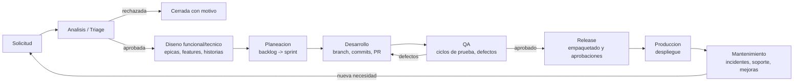

### 4.3 Workflow: Solicitud

Estatus: `Borrador, Enviada, En Analisis, Aprobada, Rechazada, Convertida, Cancelada`.

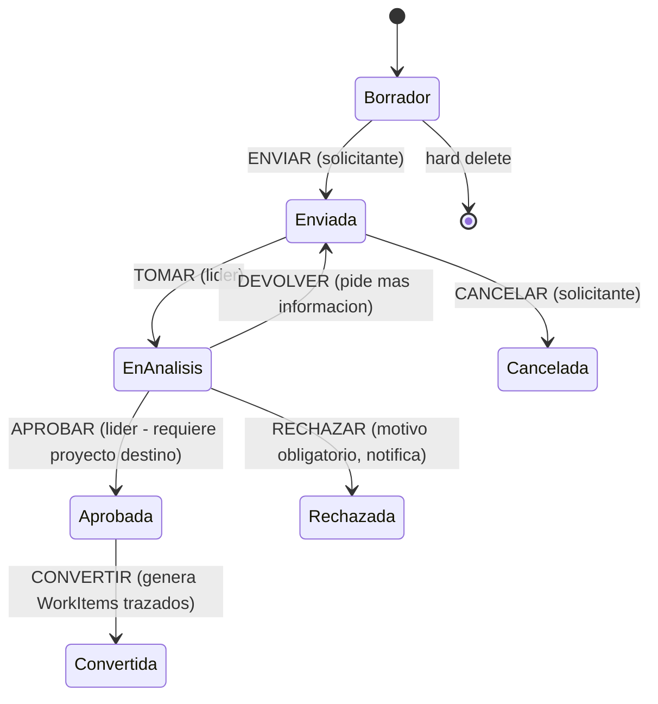

### 4.4 Workflow: WorkItem tipo Historia/Tarea (hereda el ciclo del GT)

Estatus: `Pendiente, En Proceso, En Pruebas, Correccion, Suspendido, Terminado, Cancelado`.

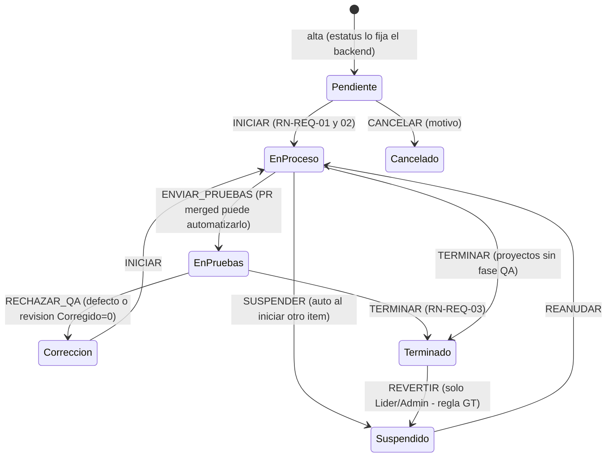

Reglas ancladas a transiciones (se validan en el AppService antes de `spCambiarEstatus`):

| Acción | Regla |
|---|---|
| INICIAR | FechaCompromiso obligatoria; suspende el otro item En Proceso del asignado (historial en el item correcto); fija `FechaInicio = ISNULL(FechaInicio, ahora)` |
| TERMINAR | >= 1 registro de tiempo o subtarea terminada; 0 revisiones pendientes; en proyectos mantenimiento exige permiso; fija `FechaFin` |
| REVERTIR | Solo desde Terminado, rol Líder/Admin |
| RECHAZAR_QA | Motivo obligatorio; crea/liga revisión o bug |
| Cualquiera | `spCambiarEstatus` garantiza el guard de concurrencia: si otro usuario ya movió el registro, 409 y la UI recarga |

### 4.5 Workflow: Bug

`Nuevo -> Confirmado -> En Proceso -> Resuelto -> Verificado -> Cerrado`, con
`RECHAZAR` desde Confirmado a `Descartado` (no es bug) y `REABRIR` de
Verificado/Cerrado a Confirmado. La verificación la hace QA (idealmente quien lo reportó).

### 4.6 Workflow: Release

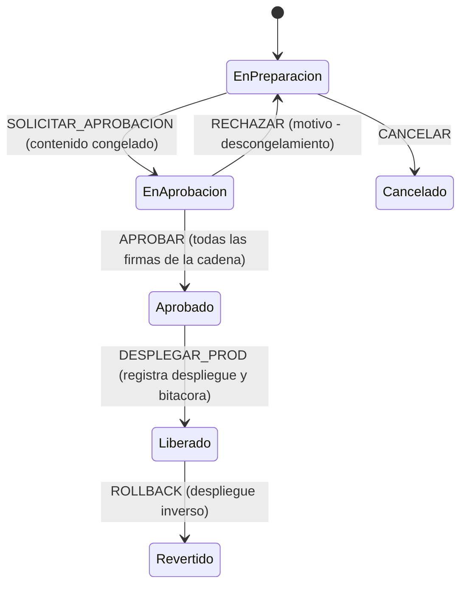

### 4.7 Workflow: Ticket de soporte

`Nuevo -> Asignado -> En Atencion -> Esperando Usuario (pausa SLA) -> Resuelto -> Cerrado`,
con `ESCALAR` (crea WorkItem tipo Soporte y deja el ticket En Atencion-Escalado) y
`REABRIR` desde Resuelto (usuario inconforme, reinicia reloj de resolución).

### 4.8 Workflows restantes

| Proceso | Estatus |
|---|---|
| Incidente | Detectado, En Atencion, Mitigado, Resuelto, Cerrado (causa raíz obligatoria en S1/S2) |
| Ausencia | Solicitada, Aprobada, Rechazada, Cancelada (aprueba el jefe directo) |
| Riesgo | Identificado, En Mitigacion, Materializado, Cerrado |
| Sprint | Planeado, Activo, Cerrado (solo un sprint Activo por equipo) |
| Revisión | Pendiente, En Proceso, Terminada (espejo del GT con su historial propio) |
| Aprobación | Pendiente, Aprobada, Rechazada |
| Proyecto | Propuesto, Autorizado, En Ejecucion, En Pausa, Cerrado, Cancelado |

### 4.9 Configurabilidad

- Alta de un proceso nuevo = receta de InterfloClaude.md seccion 9.3 (catálogo estándar,
  fila en `tblProceso`, diagrama, filas en `tblTransicion`, pruebas con rollback). **Nunca
  se toca `spCambiarEstatus` (el SP genérico).**
- Pantalla de administración de workflows (solo Admin): editor visual de transiciones que
  lee/escribe `tblTransicion` + `tblTransicionConfig`, con vista previa del diagrama.
- Las automatizaciones (sección 7) pueden disparar acciones de workflow, siempre a través
  del mismo endpoint (auditadas como usuario "sistema-automatizacion").

---

## 5. Interfaces de usuario

### 5.1 Catálogo de pantallas

| # | Pantalla | Ruta | Roles principales |
|---|---|---|---|
| P01 | Login / SSO | `/login` | Todos |
| P02 | Mi Día (home personal) | `/` | Todos |
| P03 | Bandeja de trabajo | `/trabajo` | Dev, QA, Líder |
| P04 | Detalle de WorkItem | `/wi/{folio}` | Todos |
| P05 | Tablero Kanban | `/equipos/{id}/tablero` | Dev, QA, Líder |
| P06 | Backlog y planeación de sprint | `/proyectos/{clave}/backlog` | Líder |
| P07 | Portal de solicitudes | `/solicitudes` | Solicitante |
| P08 | Triage de solicitudes | `/triage` | Líder |
| P09 | Portafolio / proyectos | `/proyectos` | Líder, Ejecutivo |
| P10 | Detalle de proyecto (tabs) | `/proyectos/{clave}` | Líder |
| P11 | Gantt / roadmap | `/proyectos/{clave}/cronograma` | Líder, PMO |
| P12 | Plan y ejecución de pruebas | `/qa/planes/{id}` | QA |
| P13 | Releases | `/proyectos/{clave}/releases` | Líder, QA |
| P14 | Detalle de release + despliegues | `/releases/{folio}` | Líder, Ops |
| P15 | Mesa de ayuda | `/soporte` | Soporte |
| P16 | Detalle de ticket | `/tickets/{folio}` | Soporte, Solicitante |
| P17 | Incidentes | `/operacion/incidentes` | Ops, Líder |
| P18 | Dashboard ejecutivo | `/dashboard` | Ejecutivo, Líder |
| P19 | Reportes | `/reportes` | Líder, PMO |
| P20 | Administración (usuarios, roles, equipos, horarios, ausencias, ambientes, repos) | `/admin/*` | Admin |
| P21 | Editor de workflows | `/admin/workflows` | Admin |
| P22 | Automatizaciones | `/admin/automatizaciones` | Admin, Líder |
| P23 | Base de conocimiento / Glosario | `/conocimiento` | Todos |
| P24 | Calendario de equipo (ausencias, festivos, releases) | `/equipos/{id}/calendario` | Todos |
| P25 | Mi perfil y preferencias | `/perfil` | Todos |
| P26 | Auditoría / bitácora | `/admin/bitacora` | Admin |

### 5.2 P02 — Mi Día (home personal)

**Objetivo:** que cada persona sepa en 5 segundos qué debe hacer hoy. Sustituye la carga
cognitiva del grid único del GT.

```
+----------------------------------------------------------------------------------+
| GTE  [Buscar folio o texto... Ctrl+K]                [Campana 3] [Avatar Ana v]  |
+------+---------------------------------------------------------------------------+
| Mi   | Hola Ana - martes 29 jul                    [+ Nuevo v] [Registrar tiempo]|
| Dia  |                                                                           |
| Trab | EN PROCESO AHORA                                                          |
| ajo  | +-----------------------------------------------------------------+      |
| Tabl | | GTE-482 Corregir calculo de retraso        [gris 2:10 hoy]      |      |
| ero  | | Historia - Proyecto GTE - vence 31 jul     [Pausar] [Terminar]  |      |
| Back | +-----------------------------------------------------------------+      |
| log  |                                                                           |
| QA   | PARA HOY (3)                          VENCIDAS (1 - rojo)                 |
| Rele | [ ] GTE-479 Endpoint estatus  [Iniciar]  GTE-455 Migrar glosario         |
| ases | [ ] GTE-488 Revision de PR #12           vencio 25 jul  [Iniciar]         |
| Sopo | [ ] TKT-0032 Impresora piso 2                                             |
| rte  |                                                                           |
| Dash | MI SPRINT (Sprint 14 - dia 6/10)      NOTIFICACIONES                      |
| bord | [########------] 8/14 pts             - Luis te menciono en GTE-479       |
|      | Burndown mini-grafica                 - Release 2.11 aprobado             |
+------+---------------------------------------------------------------------------+
```

- **Componentes:** tarjeta "En proceso ahora" (refleja RN-REQ-01: solo hay una), lista
  "para hoy" ordenada por compromiso/prioridad, vencidas en rojo, resumen de sprint,
  feed de notificaciones.
- **Acciones:** Iniciar/Pausar/Terminar directo desde la tarjeta (llaman acciones de
  workflow); registro de tiempo rápido (modal: item, minutos, descripción).
- **Validaciones:** iniciar sin compromiso -> el modal pide la fecha ahí mismo.

### 5.3 P03 — Bandeja de trabajo (sucesora directa de FrmRegistro)

**Objetivo:** operación masiva sobre items propios y del equipo. Conserva los filtros que
el equipo ya domina, sin acoplamiento posicional.

```
+----------------------------------------------------------------------------------+
| Trabajo   [Filtros: Estatus v][Proyecto v][Asignado v][Tipo v][Fechas v][Texto ] |
|           Chips activos: Estatus: Abiertos x   Asignado: Mi equipo x   [Guardar] |
+----------------------------------------------------------------------------------+
| Folio    Tipo     Titulo                Proyecto  Asignado  Estatus     Compromiso|
| GTE-482  Historia Corregir calculo...   GTE       Ana       En Proceso  31 jul   |
| GTE-455  Bug      Migrar glosario...    GTE       Ana       Pendiente   25 jul(!)|
| MANT-102 Correcc  Ajuste factura...     MANT      Luis      En Pruebas  02 ago   |
| ...                                                                              |
| [<- 1 2 3 ->]  247 items - 25 por pagina          [Exportar Excel] [Columnas v] |
+----------------------------------------------------------------------------------+
  Click derecho / menu de fila: Iniciar - Terminar - Suspender - Asignar - Copiar -
  Mover de sprint - Abrir en tablero - Historial
```

- **Filtros con la semántica heredada del GT:** estatus vacío = abiertos (Pendiente, En
  Proceso, En Pruebas, Corrección, Suspendido); "Todos" = sin filtro; sin asignado = mi
  equipo (jerarquía recursiva); toggle "todas las tareas del proyecto" (exige proyecto
  seleccionado — la UI lo deshabilita hasta elegir proyecto, corrige el bug de 0 filas).
- **Vistas guardadas** por usuario (filtros + columnas + orden) — sustituyen a
  `tblConsultas` para el uso diario.
- Colores: fila con compromiso vencido en rojo suave; En Proceso en verde suave (regla
  visual heredada).
- Selección múltiple: asignar, mover a sprint, etiquetar en lote.

### 5.4 P04 — Detalle de WorkItem (sucesor de FrmDetalle/FrmTareaSTS unificados)

```
+----------------------------------------------------------------------------------+
| GTE-482  Corregir calculo de retraso                [En Proceso v acciones]     |
| Historia - Proyecto GTE - Sprint 14 - Release 2.11        [Copiar][Compartir]   |
+---------------------------------------------+------------------------------------+
| [Descripcion][Subtareas][Tiempo][Revisiones]| Asignado    Ana Viramontes v      |
| [Pruebas][Commits][Adjuntos][Historial]     | Solicitante C. Interno            |
|                                             | Prioridad   Alta v                |
| Editor enriquecido (imagenes pegables,      | Complejidad M3 v                  |
| listas, tablas, codigo)                     | Presupuesto 6h 30m (M3 x Senior)  |
|                                             | Invertido   4h 10m  [barra 64%]   |
| Criterios de aceptacion                     | Compromiso  31 jul 2026 v         |
| [x] Retraso se congela al terminar          | Etiquetas   tiempo, reporte       |
| [ ] Solo dias laborables                    | Vinculos    Bloquea GTE-490       |
|                                             | Solicitud   SOL-2026-0045         |
+---------------------------------------------+------------------------------------+
| Comentarios (hilo, @menciones)  [Escribe un comentario...]          [Comentar]  |
+----------------------------------------------------------------------------------+
```

- El botón de estatus muestra **solo las acciones válidas** para este usuario y estatus
  (consulta al motor de workflow). Nada de botones que fallan al final.
- Presupuesto/invertido con barra de consumo (verde <80%, naranja <100%, rojo >=100%).
- Pestañas cargadas bajo demanda; el timeline de Historial une estatus + campos +
  eventos Git.
- Validaciones en vivo: compromiso < hoy marca el campo y explica el permiso necesario.

### 5.5 P05 — Tablero Kanban

Columnas mapeadas a estatus con límite WIP visible (`4/5`), tarjetas con folio, título,
avatar, puntos, chip de vencimiento; swimlanes opcionales; drag & drop dispara la acción
de workflow correspondiente (si la transición no existe, la columna se pinta
deshabilitada durante el arrastre — el usuario ve a dónde puede soltar).

### 5.6 P06 — Backlog y planeación

Dos paneles: backlog priorizado (drag para ordenar) y sprint en formación con barra de
capacidad por persona (verde/naranja/rojo al comprometer más horas que la capacidad,
calculada con horario real y ausencias). Estimación inline (complejidad y puntos sin
abrir el detalle).

### 5.7 P08 — Triage de solicitudes

Bandeja con vista previa; acciones Aprobar (elige proyecto y tipo destino; botón
"Generar historias con IA" propone el desglose editable), Rechazar (motivo obligatorio),
Devolver, Derivar a ticket. SLA interno de triage visible (días esperando).

### 5.8 P12 — Ejecución de pruebas

Runner de ciclo: lista de casos a la izquierda, caso activo al centro (pasos con
resultado por paso), botonera Pasa/Falla/Bloqueado, captura de evidencia con pegado de
imagen, "Crear bug" precargado al fallar. Barra de avance del ciclo.

### 5.9 P14 — Detalle de release

Contenido (WorkItems agrupados por tipo — vista previa de notas de versión), artefactos
con hash y validación de rollback pareado (RN-REL-02 en rojo si falta), cadena de
aprobaciones con estado por firma, historial de despliegues por ambiente, botón Rollback
(confirmación fuerte: teclear el folio).

### 5.10 P18 — Dashboard ejecutivo

Grid de widgets configurables por usuario: tiles de KPI con tendencia (flecha y
mini-sparkline), semáforo de proyectos, burndown del sprint activo por equipo, DORA
metrics, costo vs presupuesto por proyecto, cumplimiento SLA, top riesgos. Filtros
globales de periodo y equipo. Exportar a PDF.

### 5.11 Administración (P20-P22)

- Usuarios: tabla con edición lateral (drawer); asignación de roles con alcance.
- Matriz rol-permiso: checkboxes agrupados por módulo, guardado en lote (corrige el
  round-trip por fila de frmCnfgAccesos).
- Horarios: editor semanal visual de tramos; festivos en calendario anual clickeable.
- Workflows: lista de procesos -> diagrama de estados (`mermaid` renderizado) -> tabla de
  transiciones editable con vista previa.
- Automatizaciones: constructor "Cuando [evento] y [condiciones] entonces [acciones]" con
  selects tipados — sin SQL, sin JSON a mano.

---

## 6. Experiencia de usuario

| Aspecto | Definición |
|---|---|
| Navegación | Sidebar colapsable de 2 niveles (módulo -> subvista) filtrado por permisos; el usuario solo ve lo que puede usar. Rutas estables y compartibles (deep-linking por folio) |
| Breadcrumb | `Proyectos / GTE / Sprint 14 / GTE-482` — cada segmento navegable |
| Búsqueda global | `Ctrl+K`: paleta de comandos con folios, títulos, personas, artículos KB y acciones ("crear historia", "registrar tiempo"); búsqueda server-side parametrizada con debounce (corrige el query-por-tecla del GT) |
| Acciones rápidas | Botón `+ Nuevo` global (historia, bug, ticket, solicitud según permisos); atajos: `I` iniciar, `T` registrar tiempo, `C` comentar dentro del detalle |
| Dashboard personalizado | Widgets arrastrables y persistidos por usuario; layouts por rol como punto de partida |
| Notificaciones | Campana con feed en tiempo real (SignalR), agrupadas por entidad; preferencias por canal y por evento en el perfil |
| Tema oscuro | Claro/oscuro/sistema; tokens de diseño (CSS variables) desde el día 1; el tema persiste en el perfil |
| Responsive | Desktop-first para operación (grids), pero navegable en móvil: Mi Día, aprobar, comentar, consultar y registrar tiempo funcionan perfecto en teléfono (PWA instalable) |
| Accesibilidad | WCAG 2.1 AA: navegación completa por teclado, focus visible, contraste >= 4.5:1, textos de estado no solo por color (icono + texto junto al semáforo), `aria-labels` en acciones de icono |
| Rendimiento percibido | Skeletons en carga, optimistic updates en acciones de tablero con reversa ante 409, paginación server-side en toda tabla |
| Errores | El envelope `ApiResponse` trae `userMessage` legible; los 409 estructurados pintan la lista de bloqueos accionable ("No puedes terminar: 2 revisiones pendientes [ver]") |
| Onboarding | Tour de primera vez por rol; estados vacíos con explicación y acción ("Aún no tienes items. Pide a tu líder..." / "Crea tu primera historia") |

---

## 7. Automatizaciones

### 7.1 Motor de reglas

Tabla `tblReglaAutomatizacion` + ejecución vía Hangfire (consumiendo el outbox
`tblEventoDominio`). Una regla = **disparador + condiciones + acciones**, construida en UI
con selects tipados (nunca SQL ni código en datos — lección del GT):

```
CUANDO   [evento]        WorkItem.EstatusCambiado, Ticket.Creado, Release.Aprobado,
                         Sla.PorVencer(80%), Fecha.CompromisoVencida, Pr.Merged...
Y        [condiciones]   proyecto = X, prioridad in (Alta, Critica), tipo = Bug,
                         asignado.equipo = Y, dias sin movimiento > N
ENTONCES [acciones]      notificar(destinatarios, canales, plantilla),
                         ejecutar accion de workflow(accion),
                         asignar(usuario | round-robin equipo),
                         crear WorkItem(plantilla), escalar a(jefe),
                         etiquetar, mover a sprint, llamar webhook saliente
```

Toda acción ejecutada queda en bitácora como usuario `sistema-automatizacion`, con la
regla que la disparó. Las reglas tienen kill-switch individual y contador de ejecuciones.

### 7.2 Catálogo de automatizaciones de fábrica

| # | Automatización | Canal |
|---|---|---|
| A01 | Asignación de WorkItem -> notifica al asignado | In-app + Teams |
| A02 | Mención `@usuario` en comentario -> notifica | In-app + Teams |
| A03 | Compromiso vence mañana y no está Terminado -> recordatorio | In-app + correo |
| A04 | Compromiso vencido -> alerta diaria al asignado, al 3er día al líder | Correo + Teams |
| A05 | SLA de ticket al 80% -> alerta al agente; al 100% -> escala al líder y registra incumplimiento | Teams + correo; S1 tambien WhatsApp |
| A06 | Incidente S1 creado -> notificación inmediata a responsable + líder; escalamiento a los 30 min sin atención | Todos los canales |
| A07 | Solicitud sin triage 3 días -> recordatorio a líderes | Teams |
| A08 | PR abierto con folio -> item a "En Revisión"; PR merged -> "En Pruebas" | Workflow |
| A09 | Pipeline de build fallido -> notifica al autor del commit | Teams |
| A10 | Release aprobado -> publica notas de versión al canal del proyecto | Teams |
| A11 | Release liberado -> notifica a solicitantes de los items incluidos | Correo |
| A12 | Ausencia solicitada -> tarea de aprobación al jefe; aprobada -> descuenta capacidad del sprint | In-app |
| A13 | Ticket Resuelto 5 días hábiles sin respuesta -> cierre automático + encuesta | Correo |
| A14 | Item sin movimiento N días (por proyecto) -> alerta al líder | In-app |
| A15 | Caso de prueba Falla -> ofrece crear bug precargado (acción sugerida, no automática) | In-app |
| A16 | Alta de bug S1/S2 en producción -> crea incidente vinculado | Workflow |
| A17 | Viernes 13:00 -> resumen semanal del equipo al líder (terminados, en riesgo, horas) | Correo |
| A18 | Health check caído N veces -> abre incidente automático | Workflow + Teams |
| A19 | Nueva versión de GTE desplegada -> "qué hay de nuevo" al iniciar sesión | In-app |
| A20 | IA: resumen automático al cerrar incidente (timeline -> borrador de postmortem) | In-app |
| A21 | IA: prioridad sugerida al crear ticket (clasificador, editable) | In-app |
| A22 | Generación automática de tareas: aprobar solicitud puede instanciar plantilla de WorkItems (ej. "Alta de reporte": análisis + desarrollo + pruebas + release) | Workflow |
| A23 | Documentación automática: al liberar release se genera página de notas en la KB | KB |

### 7.3 Canales

`ICanalNotificacion` con implementaciones: InApp (SignalR + tabla), Correo (Graph/SMTP),
Teams (Graph/webhook entrante de canal), WhatsApp (proveedor Business API, solo alertas
críticas opt-in), Slack (webhook, opcional). Plantillas con placeholders tipados
(`{folio}`, `{titulo}`, `{url}`) versionadas en BD y editables por Admin.

---

## 8. Seguridad

### 8.1 Autenticación

| Mecanismo | Uso |
|---|---|
| OIDC contra Microsoft Entra ID (o ADFS local) | SSO primario del SPA (Authorization Code + PKCE) |
| LDAP/AD on-premise | Fallback si no hay Entra ID |
| JWT de acceso (15 min) + refresh token rotativo (8 h, HttpOnly cookie) | Sesión de la API |
| MFA | Delegado a Entra ID (política condicional); obligatorio para roles Admin y aprobadores de release |
| Tokens de servicio | Para webhooks (Gitea) y pipelines: API keys con alcance mínimo, rotables, nunca JWT de usuario |

Queda **eliminado** el modelo actual: sin `Environment.UserName` como identidad, sin
cadena SQL compartida en el cliente, sin impersonación sin credenciales. La función
"iniciar como" (soporte) se rediseña: requiere permiso `ADM.Suplantar`, re-autenticación
del suplantador, banner visible "actuando como", y **doble identidad en bitácora**
(`UsuarioReal`, `UsuarioSuplantado`).

### 8.2 Autorización (RBAC)

- Permisos atómicos por clave (`WI.Crear`, `WI.TerminarMantenimiento`, `REL.Aprobar`,
  `ADM.Usuarios`...), agrupados en roles, asignados con **alcance**: global, por proyecto
  o por equipo.
- Evaluación en backend por policy handlers (`[Authorize(Policy = "WI.Editar")]` +
  verificación de alcance contra el recurso). El frontend consume
  `GET api/v1/me/permisos` solo para ocultar UI — nunca como control real.
- La visibilidad jerárquica (jefe ve subordinados) es una dimensión adicional de alcance,
  resuelta con la jerarquía de `tblUsuario`.

### 8.3 Auditoría y bitácora

- `AuditMiddleware`: usuario, IP y sistema **siempre del token**; llena el `AuditContext`
  por request; toda escritura pasa por `RegistrarBitacoraAsync` con contexto de BD de
  vida corta (persiste aunque la transacción de negocio haga rollback).
- `tblHistorialCampo` para cambios sensibles; `tblHistorialEstatus` para ciclo de vida;
  bitácora consultable en UI (P26) con filtros por entidad/usuario/fecha.
- Retención: bitácora >= 3 años; historiales de negocio permanentes.

### 8.4 Firma electrónica y versionado

- Aprobaciones (releases, solicitudes, ausencias): registro inmutable con hash
  SHA-256(usuario + fecha UTC + entidad + folio + decisión) — verificable, no repudiable
  dentro del alcance interno.
- Versionado de documentos KB y notas de versión: cada edición crea versión nueva con
  autor y diff.

### 8.5 Endurecimiento

| Riesgo | Control |
|---|---|
| SQL injection | EF Core parametrizado en el 100% del acceso; cero SQL dinámico salvo SPs transversales blindados (`PARSENAME` + `QUOTENAME` + `sp_executesql`, patrón del motor de estatus) |
| SQL en datos | Prohibido por diseño: reportes = vistas/SPs versionados en git; automatizaciones = selects tipados |
| XSS | Contenido enriquecido sanitizado server-side (allowlist de tags); CSP estricta en el SPA |
| CSRF | JWT en header + SameSite en refresh cookie |
| Secretos | En servidor únicamente (variables de entorno / secret manager); cero credenciales en repositorio (lección Publicar.ps1) ni en cliente |
| Transporte | TLS 1.2+ obligatorio; HSTS |
| Fuerza bruta / abuso | Rate limiting en proxy + lockout delegado a Entra ID |
| Archivos | Validación de extensión y tamaño, antivirus opcional en el share, servidos por streaming con verificación de permiso sobre la entidad vinculada (nunca URL directa al share) |
| Dependencias | `dotnet list package --vulnerable` y `npm audit` en el pipeline CI |

---

## 9. API REST

### 9.1 Convenciones generales

| Aspecto | Convención |
|---|---|
| Base | `https://gte.interflo.com.mx/api/v1` — versionado por URL (`v1`, `v2` conviven en deprecación) |
| Envelope | Toda respuesta usa `ApiResponse<T>`: `{ code, success, userMessage, message, response }` con `code` en `OK, NOT_FOUND, VALIDATION_ERROR, CONFLICT, FORBIDDEN, INTERNAL_ERROR` |
| Errores | `GlobalExceptionMiddleware` mapea excepciones de dominio: NotFound 404, Validation/Business 400, Conflict 409 (con `Detalle` estructurado), Forbidden 403 |
| Paginación | `?page=1&pageSize=25` -> `response: { items, page, pageSize, totalItems, totalPages }`; `pageSize` máximo 200 |
| Filtros | Query params tipados por recurso (`?estatus=EnProceso,Pendiente&idProyecto=3&texto=factura&fechaCampo=Compromiso&desde=2026-07-01&hasta=2026-07-31`) |
| Ordenamiento | `?sort=fechaCompromiso,-prioridad` (prefijo `-` = descendente) |
| Documentación | OpenAPI/Swagger UI en `/swagger` (solo ambientes internos), generado del código con ejemplos |
| Idempotencia | POST de importación y webhooks aceptan `Idempotency-Key` |
| Auditoría | Usuario/IP siempre del JWT; el payload nunca manda auditoría |
| DTOs | Sufijos `Request`/`Response` por feature; los drafts anidados usan patrón `uiId` (id null + uiId del front, el back lo ecoa con el Id real) |

### 9.2 Mapa de endpoints (por módulo)

**Autenticación / contexto**

```
POST   /auth/token                  intercambio OIDC -> JWT propio
POST   /auth/refresh
GET    /me                          perfil + preferencias
GET    /me/permisos                 claves con alcance (solo para pintar UI)
GET    /me/notificaciones?leidas=false
PUT    /me/notificaciones/{id}/leer
```

**Workflow (transversal)**

```
GET    /workflow/{proceso}/{idRegistro}/acciones      acciones validas para el usuario
PUT    /workitems/{id}/estatus        body { accion, motivo? }   (idem tickets, releases,
PUT    /tickets/{id}/estatus           solicitudes, incidentes, ausencias, riesgos)
GET    /workflow/{proceso}/definicion  estatus + transiciones (para el editor y diagramas)
```

**WorkItems (núcleo)**

```
GET    /workitems                     bandeja: filtros, paginado, orden, vistas guardadas
POST   /workitems                     alta (estatus inicial lo fija el backend)
GET    /workitems/{folio}             detalle completo
PUT    /workitems/{id}                edición de campos (valida permisos por regla)
DELETE /workitems/{id}                borrador: hard delete; pendiente: baja lógica
POST   /workitems/{id}/copiar         RN-REQ-07
GET    /workitems/{id}/timeline       historial unificado (estatus+campos+git+pruebas)
GET    /workitems/{id}/hijos
POST   /workitems/{id}/vinculos       body { idDestino, tipoVinculo }
POST   /workitems/{id}/tiempo         registro de tiempo { fecha, minutos, descripcion }
GET    /workitems/{id}/tiempo
POST   /workitems/{id}/revisiones     hallazgo de revisión
PUT    /revisiones/{id}               corregir / reabrir (valida rol líder)
POST   /workitems/{id}/comentarios
POST   /workitems/{id}/adjuntos       multipart -> GUID
POST   /workitems/{id}/branch         crea rama en Gitea
GET    /workitems/{id}/commits
GET    /workitems/{id}/pullrequests
```

**Solicitudes / Planeación / Portafolio**

```
POST   /solicitudes                   portal del solicitante
GET    /solicitudes?estatus=Enviada   bandeja de triage
POST   /solicitudes/{id}/convertir    body { items: [ { uiId, tipo, titulo, ... } ] }
GET    /proyectos  POST /proyectos  GET /proyectos/{clave}  PUT /proyectos/{id}
GET    /proyectos/{clave}/backlog     ordenado; PUT /backlog/orden (drag & drop)
POST   /sprints    GET /sprints/{id}/capacidad   PUT /sprints/{id}/capacidad
POST   /sprints/{id}/cerrar           body { destinoItemsAbiertos }
GET    /sprints/{id}/burndown         serie diaria calculada del historial
GET    /equipos/{id}/tablero          columnas + tarjetas
PUT    /tableros/{id}/columnas        configuración (estatus, wip, orden)
GET    /proyectos/{clave}/riesgos  POST /riesgos  PUT /riesgos/{id}
GET    /proyectos/{clave}/cronograma  hitos + gantt
```

**QA / Releases / Operación / Soporte**

```
POST   /planesprueba   GET /planesprueba/{id}   POST /casosprueba
POST   /ciclos/{id}/ejecuciones       resultado por caso (+ evidencias multipart)
POST   /ejecuciones/{id}/bug          crea bug precargado
GET    /planesprueba/{id}/matriz      trazabilidad requisito x caso
POST   /pipelines/resultados-pruebas  reporte JUnit desde CI (API key)

POST   /releases   GET /releases/{folio}   POST /releases/{id}/items
POST   /releases/{id}/artefactos      registro con hash y rollback pareado
POST   /releases/{id}/aprobaciones/{idAprobacion}/resolver  { decision, comentario }
POST   /releases/{id}/despliegues     { idAmbiente, esRollback }
GET    /ambientes/matriz              versión viva por proyecto x ambiente

POST   /incidentes   PUT /incidentes/{id}   GET /operacion/disponibilidad?mes=2026-07
POST   /tickets      GET /tickets (bandeja soporte con semáforo SLA)
POST   /tickets/{id}/escalar          crea WorkItem tipo Soporte vinculado
POST   /tickets/{id}/encuesta
GET    /conocimiento?texto=...        búsqueda KB (+ /conocimiento/sugerencias?texto=)
```

**Administración / Indicadores / Integraciones**

```
GET|POST|PUT /admin/usuarios /admin/roles /admin/equipos /admin/horarios
GET|POST     /admin/ausencias        + PUT /ausencias/{id}/estatus (workflow)
GET|POST|PUT /admin/automatizaciones + POST /admin/automatizaciones/{id}/probar
GET|PUT      /admin/workflows/{proceso}
GET    /admin/bitacora?entidad=&idEntidad=&usuario=&desde=&hasta=
GET    /indicadores/dashboard?periodo=&idEquipo=
GET    /indicadores/dora?desde=&hasta=
GET    /indicadores/kpi/{clave}/serie?meses=12
POST   /webhooks/gitea                (secreto por repositorio)
POST   /import/jira                   multipart Excel/CSV, transaccional, idempotente
POST   /ia/generar-historias          { idSolicitud } -> borrador de historias
POST   /ia/generar-casos-prueba       { idWorkItem }
POST   /ia/resumir                    { entidad, id } -> resumen de timeline
```

### 9.3 Ejemplo de contrato

`PUT /api/v1/workitems/482/estatus`

```json
// Request
{ "accion": "TERMINAR" }

// Response 409 (conflicto accionable - RN-REQ-03)
{
  "code": "CONFLICT",
  "success": false,
  "userMessage": "No se puede terminar el elemento: tiene revisiones pendientes.",
  "message": "RevisionesPendientes",
  "response": {
    "detalle": {
      "revisionesPendientes": [
        { "idRevision": 91, "revisor": "Luis", "comentario": "Falta validar nulos" }
      ]
    }
  }
}
```

---

## 10. Base de datos SQL Server

Scripts de despliegue con la nomenclatura y formato obligatorios de InterfloClaude.md
seccion 10.3 (`<Secuencia>_<AAAA-MM-DD>_<Categoria>_<Objeto>.sql`, `SET XACT_ABORT ON`,
TRY/CATCH con ROLLBACK, blindaje IF EXISTS/NOT EXISTS con `SKIP:`).

### 10.1 Tanda inicial de scripts (orden de ejecución)

| Script | Contenido |
|---|---|
| `01_2026-08-03_SCRIPT_bdsGTE_Catalogos.sql` | CREATE de catálogos (estatus, tipos, prioridades, niveles, complejidad, matriz) + seeds |
| `02_2026-08-03_SCRIPT_bdsGTE_Administracion.sql` | tblUsuario, tblRol, tblPermiso, tblUsuarioRol, tblEquipo*, tblHorario*, tblDiaFestivo, tblAusencia |
| `03_2026-08-03_SCRIPT_bdsGTE_Portafolio.sql` | tblPortafolio, tblPrograma, tblProyecto, tblRiesgo, tblHito, tarifas y presupuestos |
| `04_2026-08-03_SCRIPT_bdsGTE_Nucleo.sql` | tblSolicitud, tblWorkItem, tblRegistroTiempo, tblRevision, tblComentario, tblArchivo*, tblWorkItemVinculo, tblHistorial* |
| `05_2026-08-03_SCRIPT_bdsGTE_QaReleases.sql` | QA, releases, despliegues, aprobaciones, artefactos |
| `06_2026-08-03_SCRIPT_bdsGTE_OperacionSoporte.sql` | Incidentes, tickets, SLA, KB, encuestas |
| `07_2026-08-03_SCRIPT_bdsGTE_Transversales.sql` | Bitácora, notificaciones, automatizaciones, outbox, KPI |
| `08_2026-08-03_SCRIPT_bdsGTE_Programables.sql` | Funciones, SPs, vistas, triggers |
| `09_2026-08-03_INSERT_bdsGTE_Procesos.sql` | Alta de procesos GTE en tblProceso + tblTransicion (motor de estatus propio de bdsGTE) |
| `10_2026-08-03_SCRIPT_bdsGTE_Jobs.sql` | Índices adicionales + configuración de jobs |

### 10.2 Ejemplo de tabla núcleo (extracto del script 04)

```sql
USE [bdsGTE]
GO
SET XACT_ABORT ON
BEGIN TRANSACTION
/* =====================================================================
   Script:      04_2026-08-03_SCRIPT_bdsGTE_Nucleo.sql
   Autor:       Equipo GTE
   Descripcion: Nucleo transaccional - WorkItem, tiempo, revisiones
   ===================================================================== */
BEGIN TRY

    IF NOT EXISTS (SELECT 1 FROM INFORMATION_SCHEMA.TABLES
                   WHERE TABLE_SCHEMA = 'dbo' AND TABLE_NAME = 'tblWorkItem')
    BEGIN
        CREATE TABLE [dbo].[tblWorkItem]
        (
            IdWorkItem        INT            IDENTITY(1,1) NOT NULL,
            Folio             NVARCHAR(50)                 NOT NULL,
            IdTipoWorkItem    INT                          NOT NULL,
            IdPadre           INT                          NULL,
            IdProyecto        INT                          NOT NULL,
            IdSolicitud       INT                          NULL,
            Titulo            NVARCHAR(200)                NOT NULL,
            Descripcion       NVARCHAR(MAX)                NULL,
            CriteriosAceptacion NVARCHAR(MAX)              NULL,
            IdEstatusWorkItem INT                          NOT NULL,
            IdPrioridad       INT                          NOT NULL,
            IdComplejidad     INT                          NULL,
            IdAsignado        INT                          NULL,
            IdSolicitante     INT                          NULL,
            IdSprint          INT                          NULL,
            IdRelease         INT                          NULL,
            PuntosHistoria    DECIMAL(6,2)                 NULL,
            MinutosPresupuesto INT                         NULL,
            FechaCompromiso   DATETIME2                    NULL,
            FechaInicio       DATETIME2                    NULL,
            FechaFin          DATETIME2                    NULL,
            OrdenBacklog      INT                          NULL,
            Revisado          BIT                          NOT NULL CONSTRAINT DF_tblWorkItem_Revisado DEFAULT (0),
            IdEjecucionPruebaOrigen INT                    NULL,
            ClaveJira         NVARCHAR(50)                 NULL,
            FechaRegistro     DATETIME2                    NOT NULL CONSTRAINT DF_tblWorkItem_FechaRegistro DEFAULT (SYSDATETIME()),
            UsuarioRegistro   NVARCHAR(200)                NOT NULL,
            UsuarioMovto      NVARCHAR(50)                 NULL,
            FechaMovto        DATETIME                     NULL,
            Activo            BIT                          NOT NULL CONSTRAINT DF_tblWorkItem_Activo DEFAULT (1),
            CONSTRAINT PK_tblWorkItem PRIMARY KEY (IdWorkItem),
            CONSTRAINT UQ_tblWorkItem_Folio UNIQUE (Folio),
            CONSTRAINT FK_tblWorkItem_tblTipoWorkItem FOREIGN KEY (IdTipoWorkItem) REFERENCES dbo.tblTipoWorkItem (IdTipoWorkItem),
            CONSTRAINT FK_tblWorkItem_tblWorkItem FOREIGN KEY (IdPadre) REFERENCES dbo.tblWorkItem (IdWorkItem),
            CONSTRAINT FK_tblWorkItem_tblProyecto FOREIGN KEY (IdProyecto) REFERENCES dbo.tblProyecto (IdProyecto),
            CONSTRAINT FK_tblWorkItem_tblEstatusWorkItem FOREIGN KEY (IdEstatusWorkItem) REFERENCES dbo.tblEstatusWorkItem (IdEstatusWorkItem),
            CONSTRAINT FK_tblWorkItem_tblUsuarioAsignado FOREIGN KEY (IdAsignado) REFERENCES dbo.tblUsuario (IdUsuario),
            CONSTRAINT CK_tblWorkItem_Puntos CHECK (PuntosHistoria IS NULL OR PuntosHistoria >= 0)
        )
        CREATE UNIQUE INDEX UQ_tblWorkItem_ClaveJira ON dbo.tblWorkItem (ClaveJira) WHERE ClaveJira IS NOT NULL
        CREATE INDEX IX_tblWorkItem_Bandeja ON dbo.tblWorkItem (IdAsignado, IdEstatusWorkItem, Activo)
            INCLUDE (IdProyecto, FechaCompromiso, IdPrioridad, Titulo)
        CREATE INDEX IX_tblWorkItem_Proyecto ON dbo.tblWorkItem (IdProyecto, IdEstatusWorkItem)
        CREATE INDEX IX_tblWorkItem_Sprint ON dbo.tblWorkItem (IdSprint) WHERE IdSprint IS NOT NULL
        PRINT 'OK: tblWorkItem creada correctamente'
    END
    ELSE
        PRINT 'SKIP: tblWorkItem ya existe'

    COMMIT TRANSACTION
    PRINT '===== Script ejecutado correctamente ====='
END TRY
BEGIN CATCH
    ROLLBACK TRANSACTION
    PRINT '===== ERROR - Se hizo ROLLBACK ====='
    PRINT 'Mensaje : ' + ERROR_MESSAGE()
    PRINT 'Linea   : ' + CAST(ERROR_LINE()   AS NVARCHAR(10))
    PRINT 'Numero  : ' + CAST(ERROR_NUMBER() AS NVARCHAR(10))
END CATCH
```

### 10.3 Objetos programables

| Objeto | Tipo | Responsabilidad |
|---|---|---|
| `fnMinutosLaborales(@Inicio, @Fin, @IdHorario)` | Función tabla-inline (reescritura sin cursor: tally de días x tramos + festivos de `tblDiaFestivo`) | **Motor único de tiempo laborable** — sustituye a los 4 motores inconsistentes del GT; considera festivos (corrige la omisión actual) |
| `spCambiarEstatus` | SP (plantilla seccion 10.6: encabezado, `@Mensaje OUTPUT`, TRY/CATCH) | Motor propio de GTE: lee `tblProceso`/`tblTransicion` locales, ejecuta el UPDATE dinámico blindado con guard de concurrencia, cierra el intervalo del historial materializando `MinutosLaborales` con `fnMinutosLaborales` y abre el nuevo — una transacción |
| `spRegistrarBitacora` | SP | Insert de bitácora (invocado con conexión de vida corta) |
| `spCalcularSlaTicket` | SP | Calcula fechas límite en minutos laborales del horario del SLA |
| `spSnapshotKpi` | SP | Materializa KPIs del día en `tblKpiValor` (job nocturno) |
| `spImportarJira` | SP | UPSERT con `MERGE` por ClaveJira dentro de transacción + siembra de historial (corrige sp_TareaJIRA) |
| `trWorkItemHistorialCampo` | Trigger AFTER UPDATE | Captura cambios de campos sensibles (asignado, compromiso, prioridad, complejidad) a `tblHistorialCampo` como red de seguridad debajo de la API |
| `vwBandejaTrabajo` | Vista | Proyección de bandeja (consume `MinutosLaborales` materializado — sin funciones escalares por fila) |
| `vwTiempoInvertido` | Vista | Suma de intervalos En Proceso materializados por WorkItem |
| `vwCargaEquipo`, `vwCumplimientoSla`, `vwDisponibilidadMensual` | Vistas | Reportes operativos |
| `vwBIWorkItems`, `vwBITiempos`, `vwBIReleases`, `vwBITickets` | Vistas para Power BI | Contrato estable de BI, desacoplado del esquema interno |

Jobs (Hangfire, no SQL Agent, para mantener la lógica en .NET y auditada):
snapshot nocturno de KPIs, vigilancia SLA cada 5 min, cierre automático de tickets,
recordatorios de compromiso, health checks, resumen semanal, limpieza de notificaciones
leídas > 90 días.

Optimización: estadísticas e índices revisados con Query Store activado desde el día 1;
`OPTIMIZE_FOR_SEQUENTIAL_KEY` en PKs calientes (tblHistorialEstatus, tblBitacora);
particionado por año en bitácora e historial cuando crezcan; colación única
`Modern_Spanish_CI_AS` en `bdsGTE` (una sola base en todo el sistema: sin joins cross-DB
ni conflictos de colación que vigilar).

---

## 11. Arquitectura .NET

### 11.1 Solución

```
GTE.sln
├── src/
│   ├── GTE.WebApi/                  cáscara HTTP
│   │   ├── Controllers/«Feature»Controller.cs
│   │   ├── Middleware/  (AuditMiddleware, GlobalExceptionMiddleware)
│   │   ├── Hubs/        (NotificacionesHub, TableroHub - SignalR)
│   │   ├── Models/ApiResponse.cs
│   │   ├── AutoMapperProfile.cs
│   │   └── Program.cs
│   ├── GTE.Application/
│   │   ├── «Modulo»/Commands/  (CrearWorkItemCommand + Handler + Validator)
│   │   ├── «Modulo»/Queries/   (ObtenerBandejaQuery + Handler)
│   │   ├── «Modulo»/DTOs/Request|Responses/
│   │   ├── Common/  (AuditContext, PagedResult, Behaviors MediatR)
│   │   └── Interfaces/ (I«Feature»QueryService, ICanalNotificacion, IAlmacenArchivos,
│   │                    IServicioIa, IProveedorGit, IMotorWorkflow, ICalendarioLaboral)
│   ├── GTE.Domain/
│   │   ├── «Modulo»/Entities/
│   │   ├── «Modulo»/Services/   (lógica pura: ReglasWorkItem, CalculadoraPresupuesto)
│   │   ├── Common/  (EntidadAuditable base, excepciones)
│   │   └── Interfaces/ (I«Feature»Repository)
│   ├── GTE.Infrastructure/
│   │   ├── Persistence/ (DbContextGTE, DbContextCentral - uno por base)
│   │   ├── Modelos/bdsGTE/                (scaffold de la unica base del sistema)
│   │   ├── Repositories/  (escritura, RepositoryBase con AuditContext + bitácora)
│   │   ├── Services/      (QueryServices - lectura/proyección)
│   │   └── Integraciones/ (Gitea, GitHub, Graph, Smtp, WhatsApp, ClaudeApi, Redis)
│   └── GTE.Jobs/                    Hangfire server (host aparte o mismo proceso)
├── tests/
│   ├── GTE.Domain.Tests/            reglas de negocio puras (xUnit)
│   ├── GTE.Application.Tests/       handlers con dobles de repos
│   └── GTE.Api.Tests/               integración con Testcontainers SQL Server
└── frontend/gte-web/                React (sección 12)
```

### 11.2 Stack y responsabilidades

| Pieza | Uso en GTE |
|---|---|
| .NET 8 (LTS) / ASP.NET Core | Minimal hosting, controllers clásicos por claridad de equipo. Retargeteado desde .NET 9 el 2026-08-01 (ver PENDIENTES.md §4-5) |
| EF Core 8 | Acceso a datos; DbContext por base; sin lazy loading; `AsNoTracking` en queries; migraciones NO — el esquema lo gobiernan los scripts SQL versionados (patrón del ecosistema), scaffold tras cada cambio |
| MediatR | Commands/Queries + `INotification` para eventos de dominio; pipeline behaviors: Validación -> Autorización de alcance -> Logging -> Transacción |
| FluentValidation | Un validator por Request; los mensajes viajan en `userMessage` |
| AutoMapper | Entidad <-> DTO en perfiles por módulo |
| JWT | `AddJwtBearer` con validación de issuer Entra ID + emisión propia para API keys de servicio |
| Serilog | Logging estructurado a archivo + Seq; enriquecido con usuario/traza |
| Hangfire | Jobs recurrentes y despacho del outbox; dashboard protegido con rol Admin |
| Redis | Cache distribuido (catálogos, permisos por usuario con invalidación por evento) + backplane SignalR |
| SignalR | Notificaciones en vivo y refresco de tableros (grupo por equipo) |

### 11.3 Patrones obligatorios

- Flujo por request: `Controller -> MediatR Command/Query -> Handler (AppService) ->
  Repository/QueryService -> DbContext`. Los Domain Services no tocan EF.
- Ciclo de vida del DbContext vía factory propia (`ConectarContexto<T>()`); repositorios
  sin `IDisposable` (patrón del ecosistema, seccion 7.4).
- **Métodos nombrados en español** (`ObtenerBandejaAsync`, `RegistrarTiempoAsync`,
  `CambiarEstatusAsync`) — regla dura de InterfloClaude.md seccion 2. Sin emojis ni
  símbolos decorativos en código ni commits.
- Eventos de dominio: el handler persiste el evento en el outbox dentro de la misma
  transacción; Hangfire lo despacha (notificaciones, automatizaciones, webhooks).
- El motor de workflow se consume solo vía `IMotorWorkflow.EjecutarAccionAsync(proceso,
  idRegistro, accion, motivo)` que encapsula `spCambiarEstatus` y traduce códigos RETURN
  a excepciones de dominio.
- Trampas EF conocidas (seccion 7.8): columnas computadas read-only, sin métodos
  estáticos en `.Select()`, SPs con return value vía `DbCommand`.

---

## 12. Frontend React

### 12.1 Stack

| Pieza | Elección |
|---|---|
| Base | React 18 + TypeScript estricto + Vite |
| Estado servidor | TanStack Query (cache, reintentos, invalidación por mutación y por SignalR) |
| Estado UI | Zustand (stores por feature: filtros de bandeja, tablero) |
| Rutas | React Router con lazy loading por módulo y guards por permiso |
| UI kit | MUI (Material Design) como base + DevExtreme React para Grid pesado, Gantt y Scheduler |
| Drag & drop | dnd-kit (kanban, backlog, widgets del dashboard) |
| Gráficas | Recharts (burndown, tendencias, sparklines) |
| Formularios | React Hook Form + Zod (esquemas espejo de FluentValidation — el back siempre es la fuente de verdad) |
| Editor enriquecido | TipTap (imágenes pegadas -> upload a GUID, mención @usuario) |
| Tiempo real | @microsoft/signalr |
| Calidad | ESLint + Prettier + Vitest + Playwright (flujos críticos) |

### 12.2 Estructura

```
gte-web/src/
├── app/            router, providers, tema (tokens claro/oscuro), layout Shell
├── shared/
│   ├── api/        cliente HTTP tipado (ApiResponse<T>), hooks generados de OpenAPI
│   ├── components/ DataGrid, FiltroBarra, EstatusChip, PersonaAvatar, FolioLink,
│   │               EditorRico, AdjuntosZone, ConfirmarAccion, KpiTile, Semaforo
│   ├── hooks/      usePermisos, useAccionesWorkflow, useNotificaciones (SignalR)
│   └── lib/        fechas (dayjs es-mx), formato de minutos a "6h 30m"
├── features/
│   ├── midia/  trabajo/  workitem/  tablero/  backlog/  solicitudes/
│   ├── proyectos/  qa/  releases/  soporte/  incidentes/
│   ├── dashboard/  reportes/  admin/  conocimiento/
└── pages/          composición de features por ruta
```

### 12.3 Reglas de frontend

- El front **nunca** decide estatus destino: pide `acciones` al workflow y pinta botones
  (`useAccionesWorkflow(proceso, id)`).
- Nada de mapas id->nombre locales: los DTOs traen los nombres resueltos y flags
  calculados (`soloLectura`, `puedeEditar`).
- Optimistic update solo en tablero y backlog, con rollback ante 409 + toast "alguien
  más movió este elemento" (guard de concurrencia del motor).
- Componentes clave reutilizables: `<BandejaGrid>` (server-side paging/sort/filter, columnas
  configurables persistidas), `<WorkflowActions>`, `<TimelineEntidad>`, `<GanttProyecto>`
  (DevExtreme), `<KanbanBoard>`, `<CalendarioEquipo>` (Scheduler), `<MatrizAprobaciones>`.
- Accesibilidad y tema oscuro vía tokens MUI; sin CSS suelto por componente.

---

## 13. Reportes

Todos los reportes comparten: filtros estándar (periodo con presets, proyecto, equipo,
persona), exportación (Excel vía back con EPPlus, PDF para ejecutivos), y **una sola
fuente de cálculo** (vistas/QueryServices sobre historial materializado — nunca dos
definiciones del mismo número, lección de las "3 definiciones de tarea vencida" del GT).

| # | Reporte | Contenido | Audiencia |
|---|---|---|---|
| R01 | Productividad por persona/equipo | Items terminados, puntos, % a tiempo, eficiencia (presupuesto vs invertido) | Líder |
| R02 | Horas registradas | Detalle y pivote persona x día/semana/mes; marca ausencias con "V" (sucesor del reporte mensual del GT) | Líder, RH |
| R03 | Retrabajo | % tiempo en correcciones, reaperturas por persona/proyecto, causas | Líder, QA |
| R04 | Bugs y defectos | Densidad por release/proyecto, aging, tasa de escape a producción | QA, Líder |
| R05 | Versiones/Releases | Historial por proyecto, contenido, tiempos de aprobación, frecuencia | Líder, Ops |
| R06 | Riesgos | Matriz viva, expuestos vs mitigados, materializados | PMO, Ejecutivo |
| R07 | Clientes/solicitantes | Solicitudes por área, tiempos de triage y entrega, satisfacción | Ejecutivo |
| R08 | Costos | Costo por proyecto/desarrollador/mes (horas x tarifa), comparativo | Ejecutivo |
| R09 | Rentabilidad | Presupuesto vs costo real acumulado por proyecto, proyección | Ejecutivo |
| R10 | SLA | Cumplimiento por prioridad/agente, incumplimientos con causa, CSAT | Soporte |
| R11 | KPIs / DORA | Series históricas de tblKpiValor, comparativo entre periodos | Ejecutivo |
| R12 | Carga de trabajo | WIP por persona, proyección de ocupación vs capacidad | Líder |
| R13 | Flujo (CFD) | Diagrama de flujo acumulado por estatus del historial | Líder |
| R14 | Auditoría | Movimientos por entidad/usuario/rango (desde bitácora) | Admin |

**Power BI:** vistas `vwBI*` con contrato estable + usuario SQL de solo lectura; catálogo
de datasets documentado (diccionario en la KB). Los tableros corporativos consumen BI;
los operativos viven en GTE (P18).

---

## 14. Inteligencia artificial

Integración vía `IServicioIa` (Claude API), siempre **asistiva y editable** — la IA
propone, la persona confirma; cada uso queda en bitácora. Sin datos sensibles fuera del
alcance del prompt necesario.

| # | Función | Detalle |
|---|---|---|
| IA-01 | Generación de historias | Desde una solicitud: propone épica/features/historias con criterios de aceptación en formato del equipo; el líder edita y confirma en el triage (P08) |
| IA-02 | Generación de casos de prueba | Desde historia + criterios: casos con pasos y resultados esperados, listos para editar en el plan |
| IA-03 | Priorización inteligente de tickets | Clasificador de categoría/prioridad sugerida al capturar; aprende del histórico de reclasificaciones |
| IA-04 | Estimación asistida | Sugiere complejidad comparando con items históricos similares (título/descripcion/embeddings) y muestra los 5 comparables |
| IA-05 | Resumen de incidencias | Timeline de incidente/ticket -> resumen ejecutivo + borrador de causa raíz (A20) |
| IA-06 | Resumen de reuniones | Pega la minuta/transcripción -> acuerdos y tareas propuestas (crea WorkItems en borrador) |
| IA-07 | Búsqueda semántica en KB | Embeddings de artículos KB y glosario; sugiere artículos al capturar tickets (deflection) |
| IA-08 | Detección de riesgos | Job semanal: patrones de riesgo (item grande sin avance, sprint sobrecomprometido, concentración de conocimiento en una persona) -> alertas con evidencia |
| IA-09 | Recomendación de asignación | Sugiere asignado por carga actual, historial en el módulo afectado y nivel requerido |
| IA-10 | Notas de versión | Redacta las notas del release desde los WorkItems incluidos, en tono para usuarios finales |
| IA-11 | Chat del proyecto | Asistente conversacional con herramientas de solo lectura sobre la API ("¿qué se liberó la semana pasada?", "¿cómo va el sprint 14?") respetando permisos del usuario |

Arquitectura: los casos IA-01/02/05/06/10 son llamadas puntuales con prompt + contexto
del registro; IA-07 usa una tabla de embeddings (`tblEmbedding`) refrescada por job;
IA-11 es un endpoint conversacional con tool-use limitado a QueryServices. Todos con
límites de tasa y presupuesto mensual configurable.

---

## 15. Entregables y roadmap

### 15.1 Casos de uso principales (extracto del catálogo)

| CU | Actor | Flujo principal | Reglas |
|---|---|---|---|
| CU-01 Capturar solicitud | Solicitante | Portal -> formulario -> ENVIAR -> folio SOL | Workflow 4.3 |
| CU-02 Triage | Líder | Bandeja -> revisar -> Aprobar/Rechazar/Devolver/Derivar | RN-REQ, A07 |
| CU-03 Convertir solicitud | Líder | Aprobada -> desglose (manual o IA-01) -> WorkItems trazados | uiId pattern |
| CU-04 Planear sprint | Líder | Backlog -> arrastrar a sprint contra capacidad -> activar | RN-PLA-01/03 |
| CU-05 Trabajar un item | Desarrollador | Mi Día -> INICIAR -> branch -> commits -> registrar tiempo -> ENVIAR_PRUEBAS | RN-REQ-01/02/03 |
| CU-06 Revisar código | Líder/Par | PR en Gitea + hallazgos de revisión en GTE -> corregir -> cerrar | RN-QA-02/03 |
| CU-07 Ejecutar ciclo de pruebas | QA | Runner -> resultados -> bugs precargados | RN-QA-01 |
| CU-08 Armar y aprobar release | Líder/QA/Negocio | Contenido -> congelar -> firmas -> aprobar | RN-REL-01/02/03 |
| CU-09 Desplegar y liberar | Ops | Despliegue por ambiente -> bitácora -> notificar | A10/A11 |
| CU-10 Rollback | Ops | Release liberado -> ROLLBACK -> scripts inversos -> Revertido | RN-REL-02 |
| CU-11 Atender ticket | Soporte | Bandeja -> asignar -> atender/escalar -> resolver -> encuesta | RN-SUP-01/02/03 |
| CU-12 Gestionar incidente | Ops | Detectar -> atender -> mitigar -> causa raíz -> correctivo | RN-OPS-01/02 |
| CU-13 Solicitar ausencia | Todos | Solicitud -> aprobación del jefe -> capacidad ajustada | A12 |
| CU-14 Consultar dashboard | Ejecutivo | Widgets, drill-down a listas subyacentes | Seccion 3.10 |
| CU-15 Administrar workflow | Admin | Editor -> transiciones -> pruebas -> publicar | Seccion 4.9 |
| CU-16 Importar histórico Jira/GT | Admin | Wizard de import -> vista previa -> ejecución transaccional | spImportarJira |

### 15.2 Historias de usuario semilla (formato del backlog inicial)

- HU-01: Como desarrollador quiero ver en una sola pantalla mi item en proceso y lo que
  vence hoy, para decidir mi día sin buscar en grids. (P02; criterios: solo un item En
  Proceso visible; vencidas en rojo; acciones Iniciar/Pausar/Terminar funcionales.)
- HU-02: Como líder quiero aprobar una solicitud y convertirla en historias generadas
  por IA editables, para reducir el tiempo de análisis. (P08, IA-01; criterios: borrador
  editable antes de persistir; trazabilidad SOL->WI visible.)
- HU-03: Como QA quiero que al fallar un caso se cree un bug precargado con evidencia,
  para no capturar dos veces. (P12; criterios: bug ligado a la ejecución; evidencia
  copiada.)
- HU-04: Como ejecutivo quiero ver costo real vs presupuesto por proyecto, para decidir
  inversión. (P18/R09; criterios: horas x tarifa vigente; drill-down a detalle.)
- HU-05: Como agente de soporte quiero que el reloj de SLA se pause cuando espero al
  usuario, para que el indicador sea justo. (RN-SUP-01; criterios: pausa/reanuda
  automática por estatus; semáforo consistente.)

### 15.3 Diccionario de datos y catálogo de pantallas

- Diccionario de datos: sección 2 (ER + convenciones) es la fuente; el detalle columna a
  columna se genera de la BD real con `INFORMATION_SCHEMA` a la KB tras cada tanda de
  scripts (la BD real manda sobre el documento — regla 11.3 del estándar).
- Catálogo de pantallas: sección 5.1 (P01-P26) con wireframes de las críticas.

### 15.4 Estrategia de migración desde el GT actual

1. **Congelar esquema fuente** (`bdsInfo`) y mapear: `tblTareas` -> `tblWorkItem`
   (categoría TI -> tipo Soporte/Tarea TI; `Release` reutilizada como locación se separa
   en campo propio), `tblSubtareas` -> WorkItems hijos tipo Tarea + `tblRegistroTiempo`
   (TIME -> minutos), `tblHistorialEstatus` -> historial nuevo (misma semántica,
   materializando minutos con el motor único), `tblRevisiones` -> `tblRevision`,
   `sysUsr/sysAcc` -> `tblUsuario` + roles equivalentes (el bitmap se traduce por tabla de
   mapeo de las 69 claves ACC), catálogos EAV -> catálogos tipados, Glosario -> KB
   (completo, con imágenes y tags), `tblAusencias`, `tblCalendario` -> festivos,
   `HorariosLaborales` -> `tblHorario` + tramos.
2. **Reglas de limpieza:** proyectos/asignados por texto libre se resuelven contra
   catálogo con reporte de no-matcheados; RTF -> HTML sanitizado (conversión offline);
   tareas Jira sin historial reciben intervalo sintético marcado como estimado.
3. **Corte:** migración ensayada N veces en QA con checksums (conteos por estatus, suma
   de minutos por persona/mes comparada contra el motor viejo con tolerancia documentada);
   corte de fin de semana; GT queda en solo-lectura 1 mes.

### 15.5 Roadmap de implementación

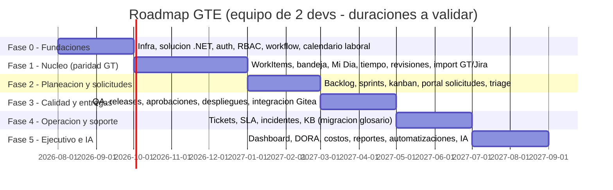

| Fase | Criterio de salida (definition of done) |
|---|---|
| 0 | Login SSO funcionando, un proceso de workflow de prueba operando vía `spCambiarEstatus`, pipeline CI con build+tests |
| 1 | **El equipo abandona el GT WinForms**: paridad funcional de bandeja/detalle/tiempos/revisiones + datos migrados verificados |
| 2 | Primer sprint planeado y cerrado dentro de GTE; solicitudes fluyen por triage |
| 3 | Primer release real aprobado y desplegado con bitácora completa. **Implementado 2026-07-31**: QA (planes, casos con pasos, ciclos, ejecuciones, bug desde falla, matriz de trazabilidad) y Entregas (contenido validado, artefactos con rollback pareado, cadena de firmas electrónicas, despliegues, rollback, notas de versión). **Pendiente de esta fase**: integración con el proveedor Git (webhooks, commits, PRs, pipelines) |
| 4 | Mesa de ayuda operando con SLA medido un mes completo |
| 5 | Dashboard ejecutivo presentado a dirección con datos reales |

Riesgos del plan: (1) equipo de 2 con operación en paralelo — mitigación: fases con valor
usable y el GT vivo hasta la fase 1; (2) calidad de datos históricos — mitigación:
reportes de excepciones de migración desde la fase 0; (3) alcance IA — mitigación: toda
la sección 14 es incremental y desactivable.

### 15.6 Pendientes de decisión del equipo (pelotear antes de codear)

1. PARCIALMENTE RESUELTO (2026-08-01): backend retargeteado de .NET 9 a **.NET 8**, ya sin
   contradicción con el estándar Frente B en ese punto (ver ADR-02 actualizado y
   PENDIENTES.md §4-5). Sigue pendiente ratificar/documentar la divergencia de frontend
   (React vs el Angular del estándar Frente B) y actualizar InterfloClaude.md en
   consecuencia.
2. RESUELTO (2026-07-30): el motor de estatus y los folios se clonan DENTRO de `bdsGTE` —
   GTE es totalmente independiente de cualquier otra base de datos.
3. Definir tarifas por nivel y política de visibilidad de costos (quién ve dinero).
4. Validar la cadena de aprobación de releases por proyecto.
5. Decidir proveedor de WhatsApp Business (o posponer ese canal).
6. Ranking/score de equipo (Doctos/Ranking.html del GT): queda fuera del alcance de las
   fases 0-5; retomar como módulo de gamificación con reglas validadas por el equipo.

---

*Documento vivo: cada sesión de trabajo que cambie una decisión debe actualizar este
documento clasificando el cambio como decisión firme, deuda técnica o corrección
(InterfloClaude.md seccion 11.2). La BD real manda sobre el documento.*
